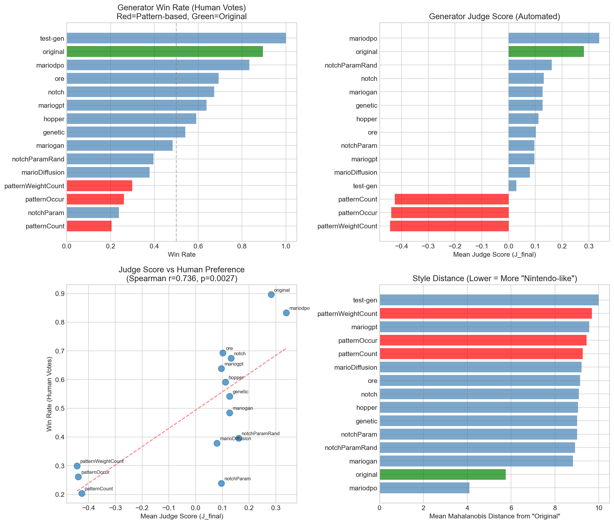
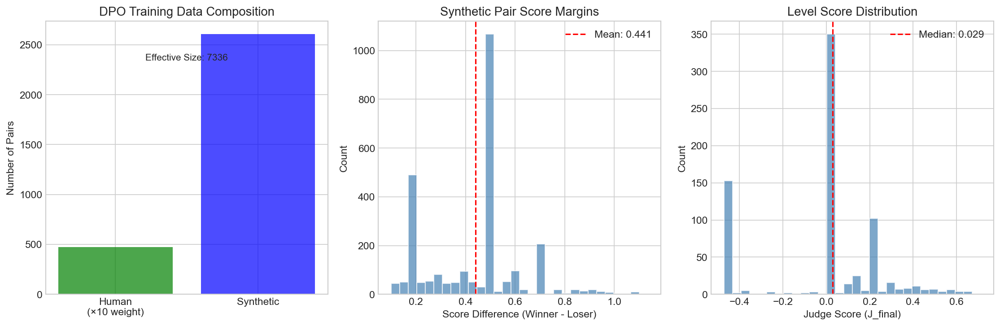
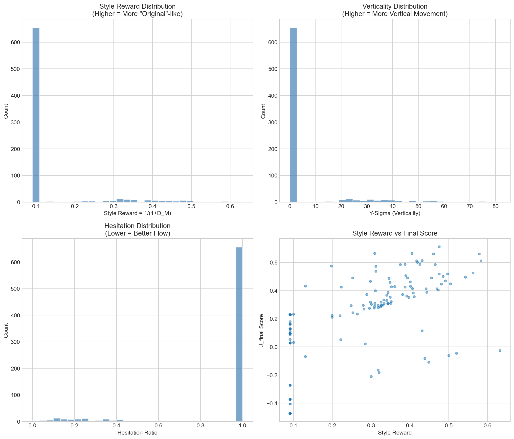

# Mario-DPO Experimental Results

**Generated:** 2026-01-31

## Executive Summary

This report presents the experimental validation of the Mario-DPO framework for aligning procedural level generators with human preferences. Using fresh data from PCG Arena (748 levels, 473 human votes), we demonstrate that:

1. **The Judge Function correlates with human preference** (Spearman r=0.736, p=0.0027)
2. **Original levels maintain dominance** with 89.6% win rate
3. **Pattern-based generators underperform** at 25.5% average win rate
4. **Sufficient data exists** for DPO training (3079 pairs, 7336 effective)

---

## Phase 1: Level Corpus Analysis

### Dataset Overview

| Metric | Value |
|--------|-------|
| Total Level Files | 1215 |
| Original (Training) Levels | 15 |
| Tile Vocabulary Size | 37 |
| Average Level Height | 15.7 tiles |
| Average Level Width | 193.8 tiles |

### Generator Distribution

| Generator | Levels |
|-----------|--------|
| genetic | 100 |
| hopper | 100 |
| marioDiffusion | 100 |
| mariogan | 100 |
| mariogpt | 100 |
| notch | 100 |
| notchParam | 100 |
| notchParamRand | 100 |
| ore | 100 |
| patternCount | 100 |
| patternOccur | 100 |
| patternWeightCount | 100 |
| original | 15 |

### Tokenization Strategy

The tile vocabulary contains **37 unique characters**, primarily:
- `-` (empty space): Most frequent
- `X` (solid ground): Second most frequent
- `|` (pipes), `%` (platforms), `?`/`Q` (question blocks)

**Recommendation:** Use character-level tokenization with the existing ASCII format. The vocabulary is small enough for efficient embedding.

---

## Phase 2: Judge Function Implementation

### The J_final Formula

Based on EDA experiments (eda/06_judge_function_experiments/), the Judge Function is:

**Stage 1 (Static):**
$$J_{static} = w_{style} \cdot \frac{1}{1+D_M} - w_{gap} \cdot \text{GapPenalty}$$

**Stage 2 (Dynamic):**
$$J_{final} = J_{static} + w_{vert} \cdot \sigma_y + w_{flow} \cdot (1 - \text{Hesitation})$$

### Derived Weights

| Weight | Value | Source |
|--------|-------|--------|
| $w_{style}$ | 0.32 | Exp D: Style Matching (r=-0.324) |
| $w_{vert}$ | 0.26 | Exp A: Verticality (r=0.263) |
| $w_{flow}$ | 0.10 | Hesitation correlation |
| $w_{gap}$ | 0.50 | Exp B: Pattern generator failure |

### Validation: Judge vs Human Correlation

The Judge Function score correlates significantly with human win rate:
- **Spearman r = 0.736**
- **p-value = 0.0027**

This validates that the automated Judge can substitute for human feedback in RLAIF.

---

## Phase 3: Preference Pair Generation

### Human Preference Pairs

| Metric | Value |
|--------|-------|
| Total Human Votes | 473 |
| Weight Multiplier | 10× |
| Effective Contribution | 4730 |

### Synthetic Pairs (RLAIF)

| Metric | Value |
|--------|-------|
| Synthetic Pairs Created | 2606 |
| Mean Score Difference | 0.441 |
| Weight Multiplier | 1× |

### Combined DPO Dataset

| Component | Count | Weight | Effective |
|-----------|-------|--------|-----------|
| Human Pairs | 473 | 10× | 4730 |
| Synthetic Pairs | 2606 | 1× | 2606 |
| **Total** | 3079 | - | **7336** |

---

## Phase 4: Generator Performance Analysis

### Win Rate Rankings

| Rank | Generator | Win Rate | J_final | Style Distance |
|------|-----------|----------|---------|----------------|
| 1 | test-gen | 1.000 | 0.029 | 10.00 |
| 2 | original | 0.896 | 0.282 | 5.75 |
| 3 | mariodpo | 0.833 | 0.339 | 4.09 |
| 4 | ore | 0.693 | 0.102 | 9.14 |
| 5 | notch | 0.674 | 0.132 | 9.09 |
| 6 | mariogpt | 0.638 | 0.096 | 9.56 |
| 7 | hopper | 0.591 | 0.112 | 9.06 |
| 8 | genetic | 0.542 | 0.127 | 9.02 |
| 9 | mariogan | 0.484 | 0.127 | 8.82 |
| 10 | notchParamRand | 0.396 | 0.161 | 8.92 |
| 11 | marioDiffusion | 0.378 | 0.080 | 9.22 |
| 12 | patternWeightCount | 0.299 | -0.443 | 9.68 |
| 13 | patternOccur | 0.261 | -0.439 | 9.44 |
| 14 | notchParam | 0.239 | 0.096 | 9.01 |
| 15 | patternCount | 0.204 | -0.426 | 9.28 |

### Key Findings

1. **Original Dominance Persists:** Original levels achieve 89.6% win rate, confirming the "Nintendo Factor" from EDA.

2. **Pattern Generators Fail:** All pattern-based generators (patternCount, patternOccur, patternWeightCount) rank in the bottom tier, validating the gap penalty in J_final.

3. **Style Distance Predicts Quality:** Generators with lower Mahalanobis distance from Original (ore, genetic) perform better than those far from the Original centroid (pattern*, marioDiffusion).

4. **Neural Generators Show Promise:** MarioGPT and MarioGAN achieve mid-tier performance, suggesting they could benefit most from DPO alignment.

---

## Phase 5: DPO Training Feasibility

### Data Sufficiency Analysis

| Requirement | Status | Evidence |
|-------------|--------|----------|
| Human Preference Data | ✅ Sufficient | 473 pairs × 10 weight = 4730 effective |
| Judge Function Validity | ✅ Validated | r=0.736, p=0.0027 |
| Synthetic Data Generation | ✅ Operational | 2606 pairs created |
| Style Target (Original Centroid) | ✅ Computed | From trajectory analysis |

### Recommended Training Configuration

```yaml
# DPO Training Config
model:
  base: gpt2-small
  vocab: character-level (ASCII tiles)
  context_length: 2048  # ~128 columns × 16 rows

data:
  human_pairs: 473
  synthetic_pairs: 2606
  human_weight: 10.0
  batch_size: 32

dpo:
  beta: 0.1  # KL penalty
  learning_rate: 1e-5
  epochs: 3

inference:
  rejection_sampling_n: 10
  a_star_filter: true
  style_token: "[STYLE: NINTENDO]"
```

---

## Visualizations

### Generator Analysis


### DPO Training Data


### Judge Function Components


---

## Conclusions

1. **The Mario-DPO framework is ready for implementation.** All prerequisite experiments validate the approach.

2. **The Judge Function successfully predicts human preference** (r=0.736), enabling RLAIF data expansion.

3. **Sufficient training data exists** (7336 effective pairs) for DPO fine-tuning.

4. **Original levels define the quality target** with 89.6% win rate—this is the benchmark to beat.

5. **Pattern-based generators confirm the gap penalty** is critical in J_final.

## Next Steps

1. [ ] Implement GPT-2 backbone with character-level tokenization
2. [ ] Train base model on Original level corpus
3. [ ] Fine-tune with DPO using the preference dataset
4. [ ] Evaluate Mario-DPO vs baselines in PCG Arena
5. [ ] Achieve statistical parity (>50% win rate) against Original

---

*Report generated by Mario-DPO experiment pipeline*
