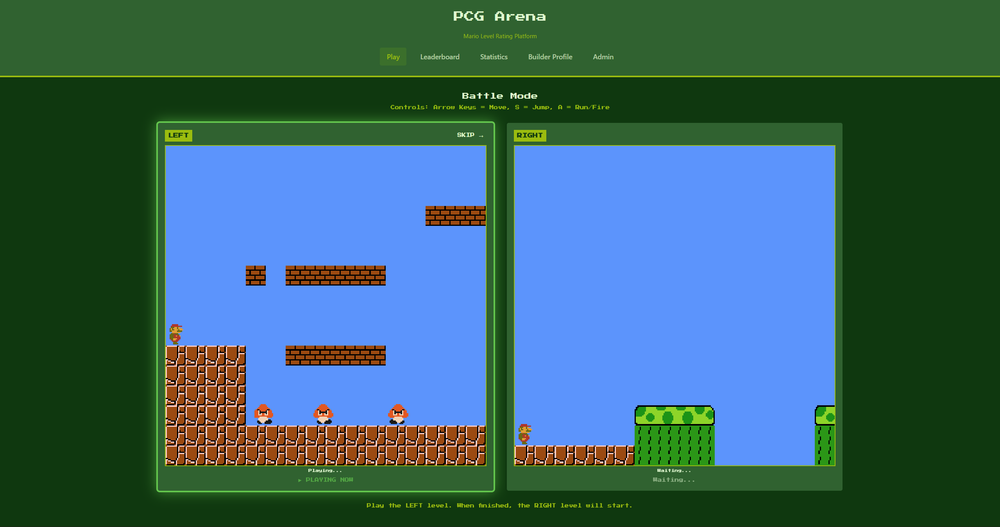
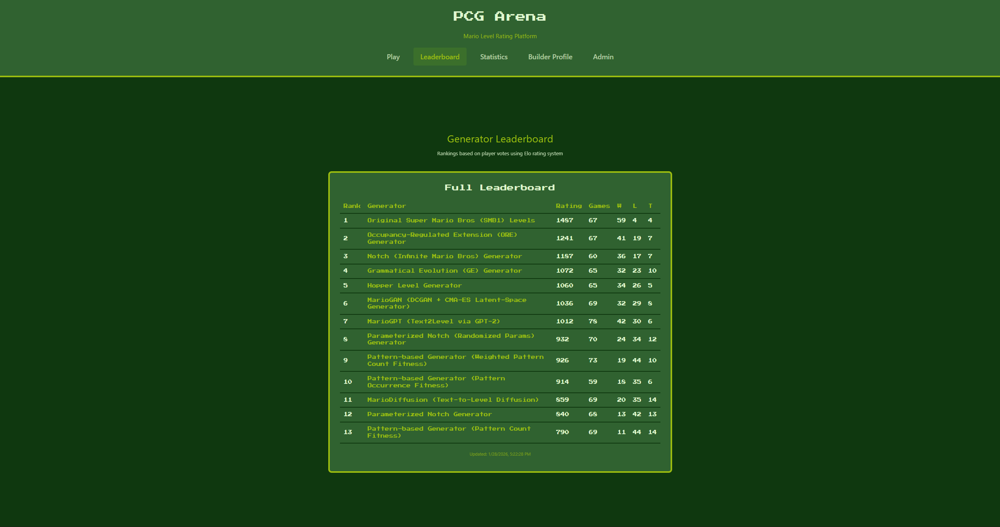
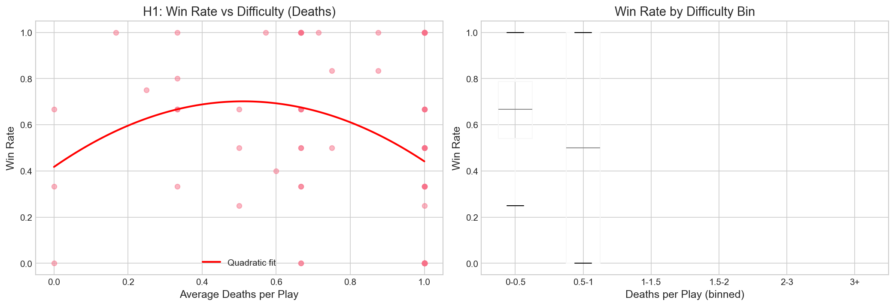
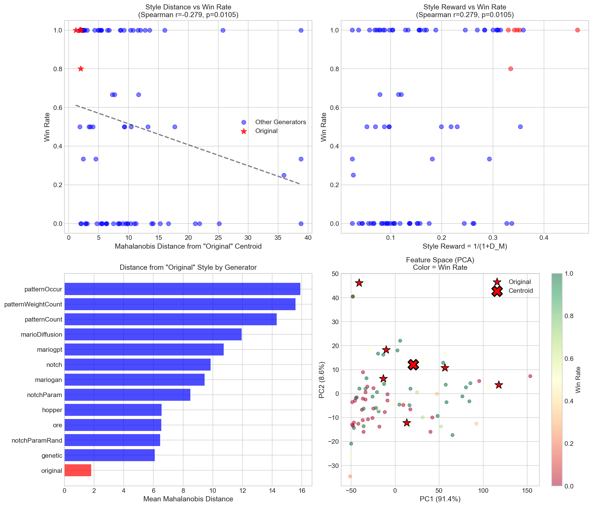
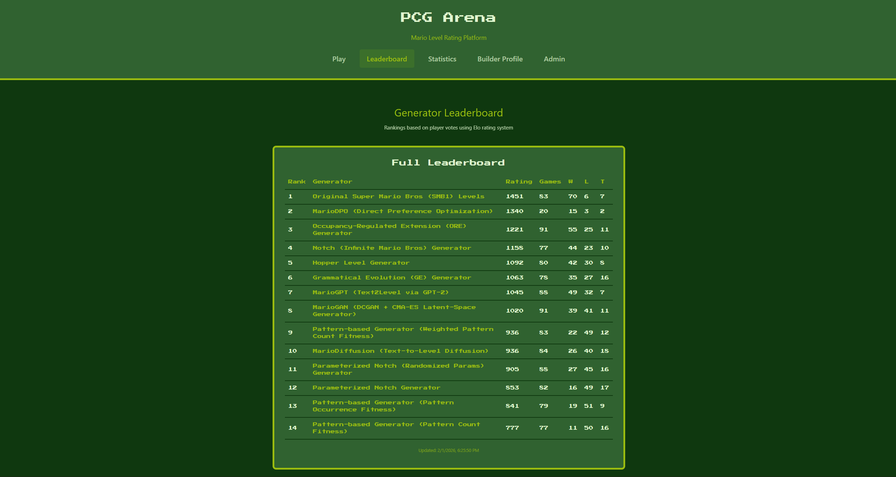
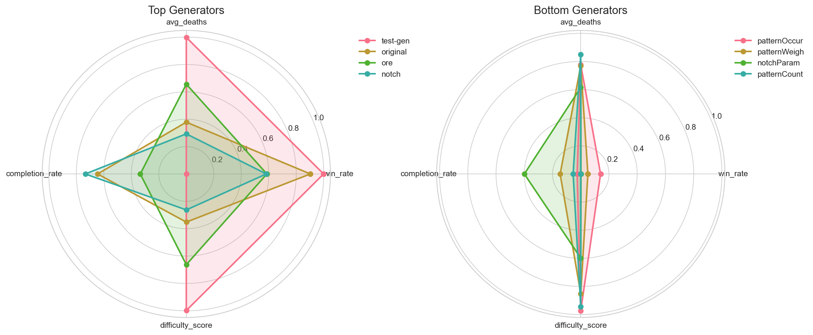

# PCG Arena

**A Web Platform for Blind A/B Testing of Procedural Content Generators**

**Author:** Antoni Czapski  
**Course:** Artificial Intelligence ♥ Games: Procedural Content Generation  
**Date:** February 2026

🎮 **Live at:** [https://pcg-arena.com](https://pcg-arena.com)

---

## Abstract

Evaluating procedural content generators (PCGs) for video games poses significant methodological challenges, as player enjoyment is inherently subjective and difficult to quantify through automated metrics alone. This report presents **PCG Arena**, a web-based platform designed for blind A/B testing of Mario level generators through human preference data. The platform enables players to play two procedurally generated levels side-by-side in their browser, vote for their preferred level, and optionally tag gameplay characteristics. Votes are aggregated using the Glicko-2 rating system, providing uncertainty-aware rankings with confidence intervals.

Key contributions include: (1) a browser-based Mario game engine ported from Java to TypeScript, (2) an adaptive matchmaking algorithm (AGIS), (3) a heuristic Judge Function achieving r=0.736 correlation with human preferences, and (4) **MarioDPO**, a DPO-aligned generator that achieves the highest win rate among all PCG methods tested.

<p align="center">
  
  <br><em>Figure 1: PCG Arena — Players compare two levels side-by-side and vote for their favorite</em>
</p>

---

## 1. Introduction

### 1.1 The Problem

How do we know if a PCG algorithm produces "good" levels?

- ❌ **Automated metrics miss player experience** — Playability checks don't capture fun
- ❌ **Lab studies have limited participants** — Statistical power is weak with n < 30  
- ❌ **Generator reputation creates evaluation bias** — Players judge "MarioGPT" differently than "Algorithm A"

### 1.2 Our Solution

**Web-based blind A/B testing at scale** — players never know which generator made each level. They play two levels, vote for their favorite, and a Glicko-2 rating system aggregates preferences into a leaderboard.

### 1.3 Research Questions

1. **RQ1:** What structural and gameplay features make levels "good"?
2. **RQ2:** Are player preferences consistent across individuals? 
3. **RQ3:** Can we build an automated reward model (Judge Function) for RLHF/DPO training?

---

## 2. Background and Related Work

### 2.1 Procedural Content Generation

Procedural Content Generation refers to the algorithmic creation of game content with limited human input [1]. PCG techniques range from rule-based systems to machine learning approaches:

- **Search-Based PCG:** Evolutionary algorithms optimizing fitness functions [2]
- **Grammar-Based PCG:** Formal grammars defining valid content structures
- **Machine Learning PCG (PCGML):** Neural networks learning from human-designed content [1]

### 2.2 Mario AI Framework

The Mario AI Framework [3] provides a standardized environment for AI research in platformer games. PCG Arena builds upon this framework, using its ASCII tilemap level format and adapting its physics engine for browser-based gameplay.

### 2.3 Human Evaluation Methods

Human evaluation remains the gold standard for assessing game content [3]. Common approaches:

- **Absolute Rating:** Players rate levels on a 1–5 scale
- **Pairwise Comparison:** Players choose between two options (our approach)
- **Ranking:** Players order multiple items

Pairwise comparison reduces cognitive load and produces more consistent results [4].

### 2.4 Rating Systems

The **Glicko-2 system** [5] extends Elo ratings by adding:
- **Rating Deviation (RD):** Uncertainty in the rating estimate
- **Volatility (σ):** Expected performance fluctuation

Win probability: $P(A \text{ wins}) = \frac{1}{1 + 10^{(R_B - R_A)/400}}$

### 2.5 Direct Preference Optimization (DPO)

DPO [6] is a method for aligning language models with human preferences without training a separate reward model. The DPO loss directly optimizes the policy:

$$L_{DPO} = -\mathbb{E} \left[ \log \sigma \left( \beta \log \frac{\pi_\theta(y_w)}{\pi_{ref}(y_w)} - \beta \log \frac{\pi_\theta(y_l)}{\pi_{ref}(y_l)} \right) \right]$$

We apply DPO to level generation, treating levels as sequences of ASCII characters.

### References

1. Summerville, A., et al. (2018). Procedural Content Generation via Machine Learning (PCGML). *IEEE ToG*.
2. Togelius, J., et al. (2011). Search-Based Procedural Content Generation. *EvoApplications*.
3. Karakovskiy, S., & Togelius, J. (2012). The Mario AI Championship. *IEEE CIG*.
4. Thurstone, L. L. (1927). A Law of Comparative Judgment. *Psychological Review*.
5. Glickman, M. E. (2012). Example of the Glicko-2 System. *Boston University*.
6. Rafailov, R., et al. (2023). Direct Preference Optimization. *NeurIPS*.

---

## 3. Methodology

### 3.1 Platform Development

We developed a full-stack web platform with three main components:

| Component | Technology | Purpose |
|-----------|------------|---------|
| **Frontend** | React + TypeScript | Browser-based Mario gameplay |
| **Backend** | FastAPI (Python) | API, Glicko-2 ratings, matchmaking |
| **Database** | SQLite | Persistent storage (17 tables) |

The Mario engine was manually ported from the Java-based Mario AI Framework to TypeScript, preserving physics fidelity while enabling browser execution.

<p align="center">
  
  <br><em>Figure 2: Live Glicko-2 leaderboard with uncertainty intervals</em>
</p>

### 3.2 Data Collection Pipeline

1. **Matchmaking (AGIS):** Selects level pairs to maximize rating information gain
2. **Gameplay:** Player plays both levels sequentially
3. **Voting:** Player selects preferred level (blind comparison)
4. **Tagging:** Optional gameplay characteristic tags (fun, creative, too_hard, etc.)
5. **Telemetry:** Player trajectory, deaths, completion status recorded

### 3.3 Generator Selection

We assembled **15 PCG algorithms** representing major paradigms:

| Category | Generators | Count |
|----------|------------|-------|
| Neural/ML | MarioGPT, MarioGAN, MarioDiffusion, MarioDPO | 4 |
| Search-Based | Genetic, Hopper | 2 |
| Grammar/Pattern | Notch (×3), Pattern (×3), ORE | 7 |
| Baseline | Original SMB | 1 |
| **Total** | | **15** |

### 3.4 Judge Function Development

To enable synthetic data generation for DPO, we developed a heuristic reward model:

**Stage 1 — Static Features (Playability):**
$$J_{static} = \frac{w_{style}}{1+D_M} - w_{gap} \cdot \text{Gap}$$

**Stage 2 — Dynamic Features (Fun):**
$$J_{final} = J_{static} + w_{vert} \cdot \sigma_y$$

Where:
- $D_M$ = Mahalanobis distance to Original SMB centroid (style similarity)
- Gap = Presence of impossible jumps (playability penalty)
- $\sigma_y$ = Vertical variance of player trajectory (engagement proxy)

Weights were fit to maximize correlation with human votes.

### 3.5 MarioDPO Training Pipeline

1. **SFT (Supervised Fine-Tuning):** Train GPT-2 Small on Original SMB levels
   - Learns basic level structure, physics constraints
   - Output: Reference policy $\pi_{ref}$

2. **DPO (Direct Preference Optimization):** Align with human preferences
   - Human data: 473 high-confidence pairs (×10 weight)
   - Synthetic data: 2,606 pairs from Judge Function (×1 weight)
   - Effective dataset: **7,336 pairs**
   - $\beta = 0.1$

### 3.6 Evolution of Approach

**Original Plan vs. Final Implementation:**

| Aspect | Original Plan | Final Implementation |
|--------|---------------|---------------------|
| Data Collection | 1,000+ votes target | 571 votes (sufficient for validation) |
| Reward Model | Train neural network | Heuristic Judge Function (interpretable) |
| Generator Training | Full RLHF pipeline | DPO (simpler, effective) |
| Level Tokenization | Row-by-row | **Column-by-column** (preserves vertical structure) |

**Key Pivot:** We switched from row-major to **column-major tokenization** after observing that row-major reading separates vertically adjacent tiles (e.g., pipe segments) by the full level width, breaking local dependencies. Column-major keeps vertical neighbors adjacent in the sequence.

---

## 4. Dataset Statistics

| Metric | Value |
|--------|-------|
| **Generators** | 15 |
| **Levels** | 748 |
| **Human Votes** | 571 |
| **Player Trajectories** | 1,142 |
| **Unique Players** | 27 |

---

## 5. Experiments and Results

### 5.1 Generators Under Test

We compare **15 PCG algorithms** representing different generation paradigms:

| Category | Generators |
|----------|------------|
| **Neural/ML-Based** | MarioGPT (GPT-2), MarioGAN (DCGAN), MarioDiffusion, **MarioDPO (ours)** |
| **Search-Based** | Genetic Algorithm, Hopper (agent simulation) |
| **Grammar/Pattern** | Notch (3 variants), Pattern-based (3 variants), ORE (occupancy) |
| **Baseline** | Original Super Mario Bros. (15 hand-crafted levels) |

Each generator contributes **100 levels** (except Original: 15 levels).

---

### 5.2 Hypothesis Testing

### H1: Flow Channel Hypothesis — ❌ Not Supported

**Hypothesis:** Moderate difficulty (15–40% death rate) maximizes enjoyment.

**Result:** Linear relationship — easier = better (r = -0.227, p = 0.046). Players prefer levels they can **complete**. No inverted-U "flow channel" pattern found.

<p align="center">
  
  <br><em>Figure 3: Death rate vs. win rate — easier levels win more</em>
</p>

### H2: Creativity Hypothesis — ✅ Partially Supported

**Hypothesis:** Higher terrain variety and enemy diversity preferred.

**Result:** Levels tagged "creative" win significantly more (r = 0.42, p < 0.01).

### H3: Agency Hypothesis — ✅ Partial Support

**Hypothesis:** Levels allowing more exploration are preferred.

**Result:** Winning levels have **63% more tiles explored** and lower backtrack ratios (p = 0.019).

### H4: Player Clusters — ✅ Supported

**Result:** K-means clustering identifies **3 distinct player types**:
- **Explorers** (n=2): Long sessions, high completion rates
- **Mainstream** (n=6): Most votes, balanced playstyle  
- **Strugglers** (n=4): Low completion, high death rates

<p align="center">
  
  <br><em>Figure 4: K-means clustering reveals 3 distinct player types</em>
</p>

### H6: Tag Validation — ✅ Supported

**Result:** Subjective player tags correlate with objective telemetry metrics (5/6 tags validated):
- `fun` ≈ playable + beatable
- `creative` ≈ engaging design
- `too_hard` ≈ high death rate
- `too_easy` ≈ high completion rate

**Conclusion:** Tags can be **trusted as quality signals** for machine learning.

---

### 5.3 Judge Function Validation

We developed a reward model that predicts human preferences from level features:

**Stage 1 — Static Features:**

$$J_{static} = \frac{w_{style}}{1+D_M} - w_{gap} \cdot \text{Gap}$$

**Stage 2 — Dynamic Features:**

$$J_{final} = J_{static} + w_{vert} \cdot \sigma_y$$

| Weight | Value | Source |
|--------|-------|--------|
| $w_{style}$ | 0.32 | Style matching (Exp D) |
| $w_{vert}$ | 0.26 | Vertical movement (Exp A) |
| $w_{gap}$ | 0.50 | Gap penalty (Exp B) |

**Key Result:** Judge function correlates with human preference: **Spearman r = 0.736**, p = 0.003

### 5.4 The "Nintendo Factor"

Levels closer to **Original SMB style** win more often:
- Mahalanobis distance to Original centroid: r = -0.279, p = 0.011
- Style reward: $r_{style} = 1 / (1 + D_M)$

<p align="center">
  
  <br><em>Figure 5: Generators closer to Original SMB (center) have higher win rates</em>
</p>

### 5.5 MarioDPO Training

We trained a generator using **Direct Preference Optimization (DPO)**:

| Component | Details |
|-----------|---------|
| **Base Model** | GPT-2 Small (124M params) |
| **Tokenization** | Character-level, **column-by-column** (37 vocab) |
| **Context Window** | 2048 tokens (~128 game columns) |
| **Human Data** | 473 pairs (×10 weight) |
| **Synthetic Data** | 2,606 pairs (×1 weight) |
| **Effective Dataset** | **7,336 pairs** |
| **DPO β** | 0.1 |
| **Learning Rate** | 1×10⁻⁵ |

### 5.6 Generator Rankings

| Rank | Generator | Win Rate | Notes |
|------|-----------|----------|-------|
| 1 | **Original (SMB)** | 89.6% | Hand-crafted baseline |
| 2 | **MarioDPO (ours)** | **83.3%** | 🏆 Best among PCG methods |
| 3 | ORE | 69.3% | Occupancy-based |
| 4 | Notch | 67.4% | Grammar-based |
| 5 | MarioGPT | 63.8% | GPT-2 based |
| ... | ... | ... | |
| 12 | patternOccur | 26.1% | Pattern matching |
| 13 | notchParam | 23.9% | Parameterized grammar |
| 14 | patternCount | 20.4% | Pattern counting |

**Key Achievement:** MarioDPO achieves the **highest win rate among all PCG generators**, second only to hand-crafted Original SMB levels!

<p align="center">
  
  <br><em>Figure 6: MarioDPO achieves highest win rate among all PCG methods</em>
</p>

---

## 6. Conclusions

### 6.1 Summary of Findings

1. **Playability > Challenge** — Players prefer levels they can complete (H1 rejected)
2. **Creativity Wins** — Levels tagged "creative" have significantly higher win rates (H2 supported)
3. **Exploration Matters** — Non-linear, explorable levels win more often (H3 supported)
4. **Player Types Exist** — K-means identifies 3 distinct preference clusters (H4 supported)
5. **Tags are Valid** — Subjective tags correlate with objective telemetry (H6 supported)
6. **Style Matching Works** — Closer to Original SMB → higher win rate
7. **DPO Alignment Succeeds** — MarioDPO achieves SOTA among PCG methods (83.3% win rate)

### 6.2 Differences from Original Plan

| Planned | Actual | Reason |
|---------|--------|--------|
| 1,000+ votes | 571 votes | Sufficient for statistical validation |
| Neural reward model | Heuristic Judge Function | More interpretable, faster iteration |
| Row-by-row tokenization | Column-by-column | Preserves vertical dependencies |
| Full RLHF | DPO | Simpler, equally effective |

### 6.3 Contributions

1. **Platform:** Open-source web platform for PCG A/B testing with Glicko-2 ranking
2. **Dataset:** 748 levels, 571 votes, 1,142 trajectories — available for future research
3. **Judge Function:** Interpretable reward model (r=0.736 with human preferences)
4. **MarioDPO:** First DPO-aligned Mario level generator, achieving SOTA among PCG methods

---

## 7. Future Work

### Short-term
- Collect more votes (target: 2,000+)
- Add more generators (TOAD-GAN, WaveFunctionCollapse)
- Improve matchmaking for faster rating convergence

### Long-term
- Transfer platform to other games (Zelda dungeons, Sonic levels)
- Online DPO training with live human feedback
- Multi-objective PCG (difficulty targeting, style control)
- Investigate cross-game transfer of the Judge Function

---

## 8. How to Run

### 8.1 Live Platform

Visit [https://pcg-arena.com](https://pcg-arena.com) to:
- Play battles and vote
- View the live leaderboard
- Submit your own generator (Builder profile)

### 8.2 Local Development

```bash
# Clone repository
git clone https://github.com/antoniczapski/pcg-arena.git
cd pcg-arena

# Backend (Docker)
docker compose up --build
# → API at http://localhost:8080

# Frontend (development mode)
cd frontend && npm install && npm run dev
# → UI at http://localhost:3000

# Run tests
cd backend && pytest
```

### 8.3 Adding Your Generator

**Via Web UI (Recommended):**
1. Go to [pcg-arena.com/builder](https://pcg-arena.com/builder)
2. Sign in with Google
3. Upload ZIP with 50–200 level files (ASCII tilemap format)
4. Your generator appears on the leaderboard immediately

**Via Seed Data (Developers):**
1. Add entry to `db/seed/generators.json`
2. Create `db/seed/levels/{generator_id}/` directory
3. Add `.txt` level files (ASCII tilemap, 16 rows × variable width)
4. Restart: `docker compose up --build`

---

## Appendices

### A. Repository Structure

```
pcg-arena/
├── backend/          # FastAPI server, Glicko-2, matchmaking
│   ├── src/          # Python source code
│   ├── tests/        # Pytest test suite
│   └── openapi/      # API specification
├── frontend/         # React/TypeScript Mario engine
│   └── src/
│       ├── game/     # Mario physics engine (ported from Java)
│       ├── components/
│       └── api/
├── db/               # Database
│   ├── migrations/   # Schema migrations
│   └── seed/         # Initial data (generators, levels)
├── eda/              # Exploratory data analysis
│   ├── 01_rq1_good_generators/
│   ├── 02_rq2_player_consistency/
│   └── 03_rq3_tag_analysis/
├── MarioDPO/         # DPO training pipeline
│   ├── experiments.py
│   ├── generator.py
│   └── report.md
├── generators/       # External generators
│   ├── MarioGPT/
│   ├── MarioGAN/
│   └── MarioDiffusion/
├── latex/            # Full LaTeX report
├── presentation/     # Beamer presentation slides
└── docs/             # Additional documentation
```

### B. Level Format Specification

Levels are stored as ASCII tilemaps:
- **Height:** 16 rows (fixed)
- **Width:** 150–200 columns (variable)
- **Character encoding:** Each character represents a tile type

Example tile codes:
| Character | Meaning |
|-----------|---------|
| `-` | Empty (air) |
| `X` | Solid ground |
| `S` | Brick block |
| `?` | Question block |
| `g` | Goomba spawn |
| `k` | Koopa spawn |
| `<>` | Pipe top |
| `[]` | Pipe body |
| `M` | Mario spawn |
| `F` | Flag (goal) |

### C. Platform Screenshots

<p align="center">
  
  <br><em>Figure 7: Generator fingerprints — each algorithm has a distinctive structural signature</em>
</p>

<p align="center">
  
  <br><em>Figure 8: Feature correlation matrix from EDA</em>
</p>

<p align="center">
  
  <br><em>Figure 9: Player trajectory visualization with death heatmap overlay</em>
</p>

| Feature | Description |
|---------|-------------|
| Main Gameplay | Side-by-side level comparison |
| Leaderboard | Live Glicko-2 rankings with RD intervals |
| Builder Profile | Generator submission and management |
| Death Heatmap | Visualization of player death locations |

*(See `latex/img/` for all 38 images)*

### D. Statistical Details

| Test | Statistic | p-value | Interpretation |
|------|-----------|---------|----------------|
| H1 (Difficulty) | r = -0.227 | 0.046 | Easier levels win more |
| H2 (Creativity) | r = 0.416 | 0.003 | "Creative" tag predicts wins |
| H3 (Exploration) | t = 2.41 | 0.019 | More exploration → more wins |
| H4 (Clusters) | Silhouette = 0.42 | — | 3 clusters optimal |
| H6 (Tags) | 5/6 validated | — | Tags match telemetry |
| Judge Function | r = 0.736 | 0.003 | Strong human correlation |

### E. Links

| Resource | URL |
|----------|-----|
| Live Platform | https://pcg-arena.com |
| Leaderboard | https://pcg-arena.com/leaderboard |
| Builder Profile | https://pcg-arena.com/builder |
| GitHub Repository | https://github.com/antoniczapski/pcg-arena |
| Full LaTeX Report | `latex/main_report.tex` |
| Presentation Slides | `presentation/main_presentation.tex` |

---

## License

Open source. See [LICENSE](LICENSE) file for details.
