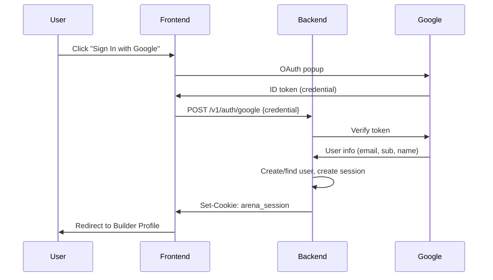
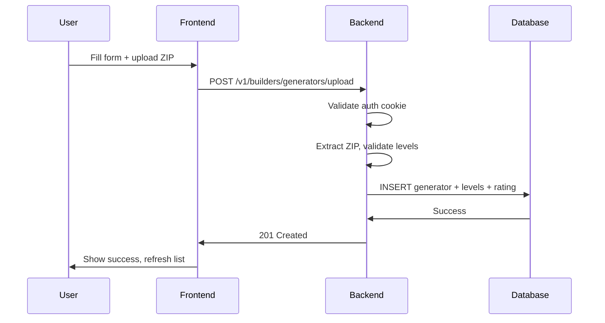

# PCG Arena — Stage 3 Specification: Builder Profile

**Location:** `docs/stage3-spec.md`  
**Protocol:** `arena/v0`  
**Status:** Phase 1 Complete (Dummy Auth), Phase 2-3 Planned

---

## 1. Overview

Stage 3 adds researcher authentication and generator submission capabilities to PCG Arena. This enables the platform to transition from a closed system with pre-seeded generators to an open platform where researchers can submit and compete with their own generators.

### 1.1 Goals

1. **Researcher Authentication:** Allow researchers to sign in (Google OAuth in production, dev auth for testing)
2. **Generator Submission:** Researchers can submit up to 3 generators with 50+ levels each
3. **Generator Management:** Update versions (keep rating), delete generators
4. **Immediate Competition:** Submitted generators appear on the leaderboard immediately

### 1.2 Phases

| Phase | Description | Status |
|-------|-------------|--------|
| Phase 1 | Dummy auth + full UI (local testing) | ✅ Complete |
| Phase 2 | Real Google OAuth | Planned |
| Phase 3 | GCP deployment with production OAuth | Planned |

---

## 2. Architecture

### 2.1 New Database Tables

```sql
-- users: Authenticated researchers
CREATE TABLE users (
    user_id TEXT PRIMARY KEY,
    email TEXT NOT NULL UNIQUE,
    google_sub TEXT UNIQUE,        -- Google's unique subject ID
    display_name TEXT NOT NULL,
    created_at_utc TEXT NOT NULL,
    last_login_utc TEXT NOT NULL
);

-- user_sessions: Active login sessions
CREATE TABLE user_sessions (
    session_token TEXT PRIMARY KEY,
    user_id TEXT NOT NULL,
    created_at_utc TEXT NOT NULL,
    expires_at_utc TEXT NOT NULL,
    FOREIGN KEY (user_id) REFERENCES users(user_id) ON DELETE CASCADE
);

-- generators table modification
ALTER TABLE generators ADD COLUMN owner_user_id TEXT REFERENCES users(user_id);
-- NULL = system-seeded generator
-- Non-NULL = user-submitted generator
```

Migration file: `db/migrations/003_users.sql`

### 2.2 Authentication Flow



### 2.3 Generator Submission Flow



---

## 3. API Endpoints

### 3.1 Authentication Endpoints

| Method | Path | Description |
|--------|------|-------------|
| `GET` | `/v1/auth/me` | Get current user (or 401) |
| `POST` | `/v1/auth/dev-login` | Dev login (requires `ARENA_DEV_AUTH=true`) |
| `POST` | `/v1/auth/google` | Exchange Google token for session |
| `POST` | `/v1/auth/logout` | Clear session cookie |

#### GET /v1/auth/me

Returns current user if authenticated.

**Response 200:**
```json
{
  "protocol_version": "arena/v0",
  "user": {
    "user_id": "u_abc123...",
    "email": "researcher@example.com",
    "display_name": "Dr. Researcher",
    "created_at_utc": "2025-12-27T10:00:00Z",
    "last_login_utc": "2025-12-27T10:00:00Z"
  }
}
```

**Response 401:** Not authenticated

#### POST /v1/auth/dev-login

Development-only login for local testing.

**Request:**
```json
{
  "email": "test@example.com",
  "display_name": "Test User"
}
```

**Response 200:** Same as `/v1/auth/me` + Set-Cookie header

**Response 403:** Dev auth disabled (`ARENA_DEV_AUTH=false`)

#### POST /v1/auth/google

Exchange Google ID token for session.

**Request:**
```json
{
  "credential": "<Google ID token>"
}
```

**Response 200:** Same as `/v1/auth/me` + Set-Cookie header

**Response 401:** Invalid token

**Response 503:** Google OAuth not configured

### 3.2 Builder Endpoints

| Method | Path | Description |
|--------|------|-------------|
| `GET` | `/v1/builders/me/generators` | List user's generators |
| `POST` | `/v1/builders/generators/upload` | Create generator (multipart) |
| `PUT` | `/v1/builders/generators/{id}/upload` | Update generator version |
| `DELETE` | `/v1/builders/generators/{id}` | Delete generator |

All builder endpoints require authentication (401 if not logged in).

#### GET /v1/builders/me/generators

**Response 200:**
```json
{
  "protocol_version": "arena/v0",
  "user_id": "u_abc123...",
  "max_generators": 3,
  "min_levels_required": 50,
  "generators": [
    {
      "generator_id": "my-neural-gen",
      "name": "Neural Level Generator",
      "version": "1.2.0",
      "description": "Uses a trained neural network...",
      "tags": ["neural", "deep-learning"],
      "documentation_url": "https://...",
      "is_active": true,
      "level_count": 75,
      "rating": 1024.5,
      "games_played": 42,
      "wins": 20,
      "losses": 18,
      "ties": 4,
      "created_at_utc": "2025-12-20T...",
      "updated_at_utc": "2025-12-27T..."
    }
  ]
}
```

#### POST /v1/builders/generators/upload

Create a new generator with levels.

**Content-Type:** `multipart/form-data`

**Form Fields:**
| Field | Type | Required | Description |
|-------|------|----------|-------------|
| `generator_id` | string | Yes | Unique ID (3-32 chars, alphanumeric/hyphens) |
| `name` | string | Yes | Display name (3-100 chars) |
| `version` | string | No | Version string (default: "1.0.0") |
| `description` | string | No | Description (max 1000 chars) |
| `tags` | string | No | Comma-separated tags (max 10) |
| `documentation_url` | string | No | URL to documentation |
| `levels_zip` | file | Yes | ZIP containing 50+ level .txt files |

**Response 201:**
```json
{
  "protocol_version": "arena/v0",
  "message": "Generator 'my-gen' created successfully with 75 levels",
  "generator": { ... }
}
```

**Error Codes:**
- `MAX_GENERATORS_EXCEEDED`: User already has 3 generators
- `GENERATOR_ID_EXISTS`: Generator ID already taken
- `NOT_ENOUGH_LEVELS`: ZIP has fewer than 50 valid levels
- `LEVEL_VALIDATION_FAILED`: Level files failed validation
- `ZIP_TOO_LARGE`: ZIP exceeds 10MB limit

#### PUT /v1/builders/generators/{id}/upload

Update generator with new version (replaces all levels, keeps rating).

Same form fields as POST, except `generator_id` comes from URL.

**Response 200:** Updated generator info

#### DELETE /v1/builders/generators/{id}

Delete generator and all its levels.

**Response 200:**
```json
{
  "protocol_version": "arena/v0",
  "message": "Generator 'my-gen' deleted successfully"
}
```

**Error 403:** Not the owner of this generator

---

## 4. Constraints and Limits

### 4.1 Per-User Limits

| Limit | Value | Configurable |
|-------|-------|--------------|
| Max generators per user | 3 | Yes (code constant) |
| Min levels per generator | 50 | Yes (code constant) |
| Max levels per generator | 200 | Yes (code constant) |
| Max ZIP size | 10 MB | Yes (code constant) |

### 4.2 Generator ID Rules

- Length: 3-32 characters
- Must start with a letter
- Allowed characters: `a-z`, `A-Z`, `0-9`, `-`, `_`
- Must be globally unique

### 4.3 Level Validation

Same rules as system-seeded levels:
- Exactly 16 lines
- All lines same width (1-250 characters)
- Only allowed tile characters (see `db/seed.py`)
- Valid UTF-8 text files

---

## 5. Session Management

### 5.1 Cookie Configuration

| Property | Value |
|----------|-------|
| Cookie name | `arena_session` |
| Duration | 30 days |
| HttpOnly | Yes (prevents XSS) |
| SameSite | Lax |
| Secure | Yes (if HTTPS) |

### 5.2 Session Token

- 32-byte cryptographically random token
- Base64-URL encoded
- Stored in `user_sessions` table
- Checked against `expires_at_utc` on each request

---

## 6. Configuration

### 6.1 Environment Variables

| Variable | Default | Description |
|----------|---------|-------------|
| `ARENA_DEV_AUTH` | `false` | Enable dev login endpoint |
| `ARENA_GOOGLE_CLIENT_ID` | (none) | Google OAuth client ID |

### 6.2 Local Testing Setup

```bash
# docker-compose.yml sets these for local development:
ARENA_DEBUG=true
ARENA_DEV_AUTH=true
```

### 6.3 Production Setup

```yaml
# docker-compose.override.yml on GCP VM:
environment:
  - ARENA_DEV_AUTH=false
  - ARENA_GOOGLE_CLIENT_ID=<your-client-id>
```

---

## 7. Frontend

### 7.1 New Routes

| Route | Component | Description |
|-------|-----------|-------------|
| `/` | `BattleFlow` | Play battles (existing) |
| `/builder` | `BuilderPage` | Builder profile |

### 7.2 New Components

| Component | Location | Description |
|-----------|----------|-------------|
| `AuthContext` | `contexts/AuthContext.tsx` | Auth state management |
| `BuilderPage` | `pages/BuilderPage.tsx` | Builder dashboard |
| `GeneratorCard` | (inline) | Display one generator |
| `GeneratorForm` | (inline) | Create/update form |

### 7.3 Dependencies Added

```json
{
  "react-router-dom": "^6.20.0"
}
```

---

## 8. Phase 2: Google OAuth

### 8.1 Google Cloud Console Setup

1. Go to GCP Console → APIs & Services → Credentials
2. Create OAuth 2.0 Client ID (Web application)
3. Add authorized JavaScript origins:
   - `http://localhost:3000` (dev)
   - `https://www.pcg-arena.com` (prod)
4. Copy Client ID

### 8.2 Frontend Integration

Add `@react-oauth/google` package:

```bash
npm install @react-oauth/google
```

Wrap app in `GoogleOAuthProvider`:

```tsx
import { GoogleOAuthProvider } from '@react-oauth/google';

<GoogleOAuthProvider clientId={GOOGLE_CLIENT_ID}>
  <App />
</GoogleOAuthProvider>
```

Use `GoogleLogin` component:

```tsx
import { GoogleLogin } from '@react-oauth/google';

<GoogleLogin
  onSuccess={credentialResponse => {
    // Send credential to backend
    await fetch('/v1/auth/google', {
      method: 'POST',
      body: JSON.stringify({ credential: credentialResponse.credential }),
      credentials: 'include',
    });
  }}
/>
```

### 8.3 Backend Token Verification

```python
from google.oauth2 import id_token
from google.auth.transport import requests

def verify_google_token(credential: str, client_id: str):
    idinfo = id_token.verify_oauth2_token(
        credential,
        requests.Request(),
        client_id
    )
    return {
        "email": idinfo["email"],
        "google_sub": idinfo["sub"],
        "name": idinfo.get("name", idinfo["email"])
    }
```

---

## 9. Phase 3: GCP Deployment

### 9.1 Environment Configuration

Add to `docker-compose.override.yml` on VM:

```yaml
environment:
  - ARENA_DEV_AUTH=false
  - ARENA_GOOGLE_CLIENT_ID=<your-client-id>
```

### 9.2 Frontend Build

Update `.env.production`:

```bash
VITE_GOOGLE_CLIENT_ID=<your-client-id>
```

Build and deploy:

```bash
cd ~/pcg-arena/frontend
npm install
npm run build
sudo cp -r dist/* /var/www/pcg-arena/
```

### 9.3 Caddyfile Update

No changes needed - existing config handles `/v1/auth/*` and `/v1/builders/*` via wildcard.

---

## 10. Privacy and Compliance

### 10.1 Data Stored

For authenticated users, we store:
- Email address (from Google OAuth)
- Display name (from Google OAuth)
- Login timestamps
- Generator submissions

### 10.2 Privacy Notice

Add a simple privacy notice on the login page:

> By signing in, you agree to store your email address and display name for account purposes. We do not share your data with third parties.

### 10.3 Data Deletion

Users can delete their generators. Full account deletion should be added in a future update.

---

## 11. Testing Checklist

### Phase 1 (Dummy Auth) - Local Testing

- [ ] Backend starts with new migration applied
- [ ] Dev login creates test user session
- [ ] Auth cookie is set and persists
- [ ] `/v1/auth/me` returns user info
- [ ] `/v1/builders/me/generators` returns empty list
- [ ] Can create generator with valid ZIP
- [ ] Generator appears on leaderboard immediately
- [ ] Can update generator (new version, same rating)
- [ ] Can delete generator
- [ ] Cannot create more than 3 generators
- [ ] Invalid ZIP rejected with clear error
- [ ] Logout clears session

### Phase 2 (Real Auth) - Local Testing

- [ ] Google OAuth popup appears
- [ ] Token exchange creates session
- [ ] New Google users get accounts created
- [ ] Returning users are recognized

### Phase 3 (Production)

- [ ] HTTPS cookies work correctly
- [ ] OAuth redirect works with domain
- [ ] Dev auth disabled
- [ ] Rate limits enforced

---

## 12. File Changes Summary

### New Files

| File | Description |
|------|-------------|
| `db/migrations/003_users.sql` | Users table and generator ownership |
| `backend/src/auth.py` | Authentication module |
| `backend/src/builders.py` | Builder profile module |
| `frontend/src/contexts/AuthContext.tsx` | Auth state management |
| `frontend/src/pages/BuilderPage.tsx` | Builder dashboard page |
| `frontend/src/styles/builder.css` | Builder page styles |
| `docs/stage3-spec.md` | This specification |

### Modified Files

| File | Changes |
|------|---------|
| `backend/requirements.txt` | Added python-multipart, google-auth |
| `backend/src/config.py` | Added dev_auth, google_client_id |
| `backend/src/main.py` | Added auth and builder endpoints |
| `frontend/package.json` | Added react-router-dom |
| `frontend/src/App.tsx` | Added routing and AuthProvider |
| `frontend/src/styles/components.css` | Added navigation styles |
| `docker-compose.yml` | Added ARENA_DEV_AUTH=true |

---

## Appendix A: Level Format Reference

Levels must be ASCII tilemap files with:

- **Height:** 16 lines (fixed)
- **Width:** 1-250 characters (variable, but consistent within file)
- **Encoding:** UTF-8
- **Newlines:** `\n` (will normalize `\r\n`)

See `db/seed.py` for the complete tile alphabet.

---

## Appendix B: Error Codes

| Code | HTTP | Description |
|------|------|-------------|
| `MAX_GENERATORS_EXCEEDED` | 400 | User has 3 generators |
| `GENERATOR_ID_EXISTS` | 409 | ID already taken |
| `INVALID_GENERATOR_ID` | 400 | ID format invalid |
| `NOT_ENOUGH_LEVELS` | 400 | ZIP has <50 valid levels |
| `TOO_MANY_LEVELS` | 400 | ZIP has >200 levels |
| `LEVEL_VALIDATION_FAILED` | 400 | Level files invalid |
| `INVALID_ZIP` | 400 | Not a valid ZIP |
| `ZIP_TOO_LARGE` | 400 | ZIP exceeds 10MB |
| `NOT_OWNER` | 403 | Not generator owner |

---

**End of Stage 3 Specification**

