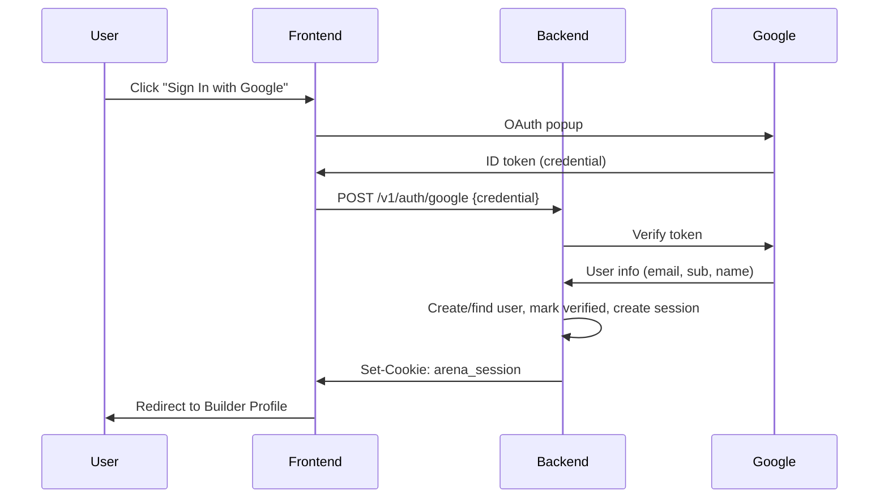
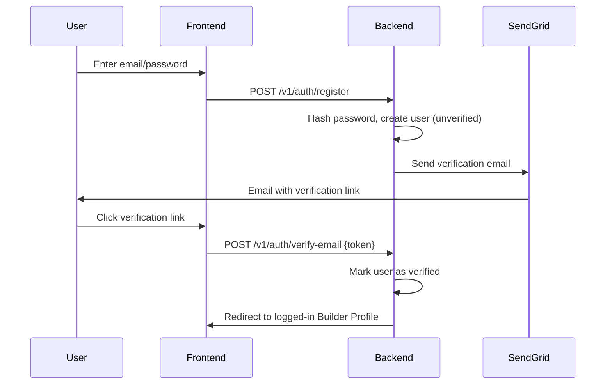
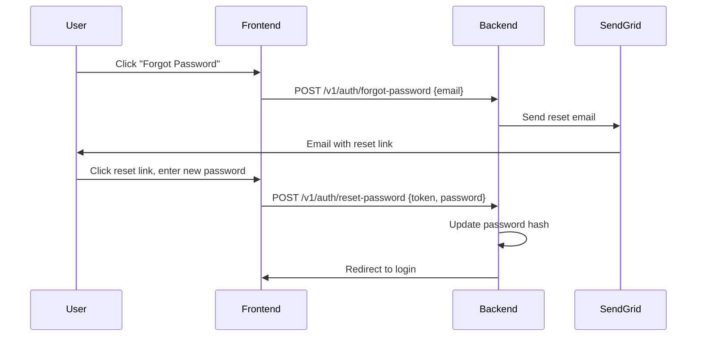
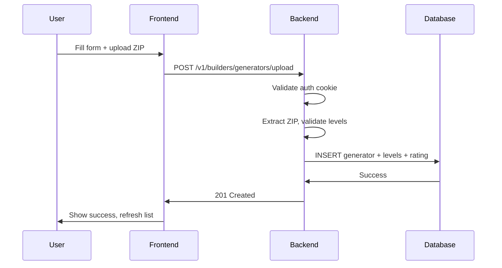

# PCG Arena — Stage 3 Specification: Builder Profile

**Location:** `docs/stage3-spec.md`  
**Protocol:** `arena/v0`  
**Status:** ✅ COMPLETE & DEPLOYED TO PRODUCTION (2025-12-28)

---

## 1. Overview

Stage 3 adds researcher authentication and generator submission capabilities to PCG Arena. This enables the platform to transition from a closed system with pre-seeded generators to an open platform where researchers can submit and compete with their own generators.

### 1.1 Goals

1. **Researcher Authentication:** Allow researchers to sign in (Google OAuth + Email/Password)
2. **Generator Submission:** Researchers can submit up to 3 generators with 50-200 levels each
3. **Generator Management:** Update versions (keep rating), delete generators (soft delete for generators with battles)
4. **Immediate Competition:** Submitted generators appear on the leaderboard immediately
5. **Email Verification:** Ensure valid email addresses before allowing submissions
6. **Password Reset:** Allow users to reset forgotten passwords

### 1.2 Implementation Status

| Phase | Description | Status |
|-------|-------------|--------|
| Phase 1 | Dummy auth + full UI (local testing) | ✅ Complete |
| Phase 2 | Google OAuth + Email/Password authentication | ✅ Complete |
| Phase 3 | Email verification + Password reset | ✅ Complete |
| Phase 4 | Data integrity (soft delete, battle preservation) | ✅ Complete |

---

## 2. Architecture

### 2.1 New Database Tables

```sql
-- users: Authenticated researchers
CREATE TABLE users (
    user_id TEXT PRIMARY KEY,
    email TEXT NOT NULL UNIQUE,
    google_sub TEXT UNIQUE,        -- Google's unique subject ID (NULL for email/password users)
    display_name TEXT NOT NULL,
    password_hash TEXT,             -- NULL for Google OAuth users
    is_email_verified INTEGER NOT NULL DEFAULT 0,  -- 1 for verified, 0 for pending
    created_at_utc TEXT NOT NULL,
    last_login_utc TEXT NOT NULL
);

-- user_sessions: Active login sessions
CREATE TABLE user_sessions (
    session_token TEXT PRIMARY KEY,
    user_id TEXT NOT NULL,
    created_at_utc TEXT NOT NULL,
    expires_at_utc TEXT NOT NULL,
    FOREIGN KEY (user_id) REFERENCES users(user_id) ON DELETE CASCADE
);

-- email_verification_tokens: Email verification tokens
CREATE TABLE email_verification_tokens (
    token TEXT PRIMARY KEY,
    user_id TEXT NOT NULL,
    expires_at_utc TEXT NOT NULL,
    created_at_utc TEXT NOT NULL,
    FOREIGN KEY (user_id) REFERENCES users(user_id) ON DELETE CASCADE
);

-- password_reset_tokens: Password reset tokens
CREATE TABLE password_reset_tokens (
    token TEXT PRIMARY KEY,
    user_id TEXT NOT NULL,
    expires_at_utc TEXT NOT NULL,
    created_at_utc TEXT NOT NULL,
    FOREIGN KEY (user_id) REFERENCES users(user_id) ON DELETE CASCADE
);

-- generators table modification
ALTER TABLE generators ADD COLUMN owner_user_id TEXT REFERENCES users(user_id);
-- NULL = system-seeded generator
-- Non-NULL = user-submitted generator
```

Migration files:
- `db/migrations/003_users.sql` - Users and sessions tables
- `db/migrations/004_password_auth.sql` - Password hash column
- `db/migrations/005_email_verification.sql` - Email verification
- `db/migrations/006_password_reset.sql` - Password reset tokens

### 2.2 Authentication Flows

#### Google OAuth Flow



#### Email/Password Registration Flow



#### Password Reset Flow



### 2.3 Generator Submission Flow



---

## 3. API Endpoints

### 3.1 Authentication Endpoints

| Method | Path | Description |
|--------|------|-------------|
| `GET` | `/v1/auth/me` | Get current user (or 401) |
| `POST` | `/v1/auth/dev-login` | Dev login (requires `ARENA_DEV_AUTH=true`) |
| `POST` | `/v1/auth/google` | Exchange Google token for session |
| `POST` | `/v1/auth/register` | Register with email/password |
| `POST` | `/v1/auth/login` | Login with email/password |
| `POST` | `/v1/auth/verify-email` | Verify email with token |
| `POST` | `/v1/auth/resend-verification` | Resend verification email |
| `POST` | `/v1/auth/forgot-password` | Request password reset |
| `POST` | `/v1/auth/reset-password` | Reset password with token |
| `POST` | `/v1/auth/logout` | Clear session cookie |

#### GET /v1/auth/me

Returns current user if authenticated.

**Response 200:**
```json
{
  "protocol_version": "arena/v0",
  "user": {
    "user_id": "u_abc123...",
    "email": "researcher@example.com",
    "display_name": "Dr. Researcher",
    "is_email_verified": true,
    "created_at_utc": "2025-12-27T10:00:00Z",
    "last_login_utc": "2025-12-27T10:00:00Z"
  }
}
```

**Response 401:** Not authenticated

#### POST /v1/auth/dev-login

Development-only login for local testing.

**Request:**
```json
{
  "email": "test@example.com",
  "display_name": "Test User"
}
```

**Response 200:** Same as `/v1/auth/me` + Set-Cookie header

**Response 403:** Dev auth disabled (`ARENA_DEV_AUTH=false`)

#### POST /v1/auth/google

Exchange Google ID token for session.

**Request:**
```json
{
  "credential": "<Google ID token>"
}
```

**Response 200:** Same as `/v1/auth/me` + Set-Cookie header

**Response 401:** Invalid token

**Response 503:** Google OAuth not configured

#### POST /v1/auth/register

Register a new user with email and password.

**Request:**
```json
{
  "email": "researcher@example.com",
  "password": "SecurePassword123!",
  "display_name": "Dr. Researcher"
}
```

**Response 200:**
```json
{
  "protocol_version": "arena/v0",
  "message": "Registration successful. Please check your email to verify your account.",
  "user": {
    "user_id": "u_abc123...",
    "email": "researcher@example.com",
    "display_name": "Dr. Researcher",
    "is_email_verified": false
  }
}
```

**Response 409:** Email already registered

**Response 400:** Invalid email or weak password

#### POST /v1/auth/login

Login with email and password.

**Request:**
```json
{
  "email": "researcher@example.com",
  "password": "SecurePassword123!"
}
```

**Response 200:** Same as `/v1/auth/me` + Set-Cookie header

**Response 401:** Invalid credentials

**Response 403:** Email not verified

#### POST /v1/auth/verify-email

Verify email address with token from email.

**Request:**
```json
{
  "token": "base64url_token_from_email"
}
```

**Response 200:**
```json
{
  "protocol_version": "arena/v0",
  "message": "Email verified successfully",
  "user": { ... }
}
```

**Response 400:** Invalid or expired token

#### POST /v1/auth/resend-verification

Resend verification email to current user.

**Response 200:**
```json
{
  "protocol_version": "arena/v0",
  "message": "Verification email sent"
}
```

**Response 401:** Not authenticated

#### POST /v1/auth/forgot-password

Request password reset email.

**Request:**
```json
{
  "email": "researcher@example.com"
}
```

**Response 200:**
```json
{
  "protocol_version": "arena/v0",
  "message": "If that email exists, a password reset link has been sent"
}
```

#### POST /v1/auth/reset-password

Reset password with token from email.

**Request:**
```json
{
  "token": "base64url_token_from_email",
  "new_password": "NewSecurePassword123!"
}
```

**Response 200:**
```json
{
  "protocol_version": "arena/v0",
  "message": "Password reset successfully"
}
```

**Response 400:** Invalid or expired token, or weak password

### 3.2 Builder Endpoints

| Method | Path | Description |
|--------|------|-------------|
| `GET` | `/v1/builders/me/generators` | List user's generators |
| `POST` | `/v1/builders/generators/upload` | Create generator (multipart) |
| `PUT` | `/v1/builders/generators/{id}/upload` | Update generator version |
| `DELETE` | `/v1/builders/generators/{id}` | Delete generator |

All builder endpoints require authentication (401 if not logged in).

#### GET /v1/builders/me/generators

**Response 200:**
```json
{
  "protocol_version": "arena/v0",
  "user_id": "u_abc123...",
  "max_generators": 3,
  "min_levels_required": 50,
  "max_levels_allowed": 200,
  "generators": [
    {
      "generator_id": "my-neural-gen",
      "name": "Neural Level Generator",
      "version": "1.2.0",
      "description": "Uses a trained neural network...",
      "tags": ["neural", "deep-learning"],
      "documentation_url": "https://...",
      "is_active": true,
      "level_count": 75,
      "rating": 1024.5,
      "games_played": 42,
      "wins": 20,
      "losses": 18,
      "ties": 4,
      "created_at_utc": "2025-12-20T...",
      "updated_at_utc": "2025-12-27T..."
    }
  ]
}
```

#### POST /v1/builders/generators/upload

Create a new generator with levels.

**Content-Type:** `multipart/form-data`

**Form Fields:**
| Field | Type | Required | Description |
|-------|------|----------|-------------|
| `generator_id` | string | Yes | Unique ID (3-32 chars, alphanumeric/hyphens) |
| `name` | string | Yes | Display name (3-100 chars) |
| `version` | string | No | Version string (default: "1.0.0") |
| `description` | string | No | Description (max 1000 chars) |
| `tags` | string | No | Comma-separated tags (max 10) |
| `documentation_url` | string | No | URL to documentation |
| `levels_zip` | file | Yes | ZIP containing 50+ level .txt files |

**Response 201:**
```json
{
  "protocol_version": "arena/v0",
  "message": "Generator 'my-gen' created successfully with 75 levels",
  "generator": { ... }
}
```

**Error Codes:**
- `MAX_GENERATORS_EXCEEDED`: User already has 3 generators
- `GENERATOR_ID_EXISTS`: Generator ID already taken
- `NOT_ENOUGH_LEVELS`: ZIP has fewer than 50 valid levels
- `LEVEL_VALIDATION_FAILED`: Level files failed validation
- `ZIP_TOO_LARGE`: ZIP exceeds 10MB limit

#### PUT /v1/builders/generators/{id}/upload

Update generator with new version (replaces all levels, keeps rating).

Same form fields as POST, except `generator_id` comes from URL.

**Response 200:** Updated generator info

#### DELETE /v1/builders/generators/{id}

Delete generator and all its levels. Uses **soft delete** if the generator has existing battles (sets `is_active=0`, clears `owner_user_id`, appends `[deleted]` to name). Uses **hard delete** only if no battles exist.

**Response 200:**
```json
{
  "protocol_version": "arena/v0",
  "message": "Generator 'my-gen' deleted successfully"
}
```

**Error 403:** Not the owner of this generator

**Note:** Soft-deleted generators remain in the database to preserve battle history but are excluded from matchmaking.

---

## 4. Constraints and Limits

### 4.1 Per-User Limits

| Limit | Value | Configurable |
|-------|-------|--------------|
| Max generators per user | 3 | Yes (code constant) |
| Min levels per generator | 50 | Yes (code constant) |
| Max levels per generator | 200 | Yes (code constant) |
| Max ZIP size | 10 MB | Yes (code constant) |

### 4.2 Generator ID Rules

- Length: 3-32 characters
- Must start with a letter
- Allowed characters: `a-z`, `A-Z`, `0-9`, `-`, `_`
- Must be globally unique

### 4.3 Level Validation

Same rules as system-seeded levels:
- Exactly 16 lines
- All lines same width (1-250 characters)
- Only allowed tile characters (see `db/seed.py`)
- Valid UTF-8 text files

---

## 5. Session Management

### 5.1 Cookie Configuration

| Property | Value |
|----------|-------|
| Cookie name | `arena_session` |
| Duration | 30 days |
| HttpOnly | Yes (prevents XSS) |
| SameSite | Lax |
| Secure | Yes (if HTTPS) |

### 5.2 Session Token

- 32-byte cryptographically random token
- Base64-URL encoded
- Stored in `user_sessions` table
- Checked against `expires_at_utc` on each request

---

## 6. Configuration

### 6.1 Environment Variables

| Variable | Default | Description |
|----------|---------|-------------|
| `ARENA_DEV_AUTH` | `false` | Enable dev login endpoint |
| `ARENA_GOOGLE_CLIENT_ID` | (none) | Google OAuth client ID |
| `ARENA_SENDGRID_API_KEY` | (none) | SendGrid API key for emails |
| `ARENA_SENDER_EMAIL` | (none) | Sender email address (e.g., noreply@pcg-arena.com) |
| `ARENA_FRONTEND_URL` | (none) | Frontend URL for email links (e.g., http://localhost:3000) |

### 6.2 Local Testing Setup

```bash
# .env file (gitignored) contains:
GOOGLE_CLIENT_ID=your_client_id_here.apps.googleusercontent.com
SENDGRID_API_KEY=SG.xxxxxxxxxxxxxxxxxx
SENDGRID_FROM_EMAIL=noreply@pcg-arena.com

# docker-compose.yml sets these for local development:
ARENA_DEBUG=true
ARENA_DEV_AUTH=true
ARENA_GOOGLE_CLIENT_ID=${GOOGLE_CLIENT_ID:-}
ARENA_SENDGRID_API_KEY=${SENDGRID_API_KEY:-}
ARENA_SENDER_EMAIL=${SENDGRID_FROM_EMAIL:-noreply@pcg-arena.com}
ARENA_FRONTEND_URL=http://localhost:3000
```

### 6.3 Production Setup

```yaml
# docker-compose.override.yml on GCP VM:
environment:
  - ARENA_DEV_AUTH=false
  - ARENA_GOOGLE_CLIENT_ID=<your-client-id>
  - ARENA_SENDGRID_API_KEY=<your-api-key>
  - ARENA_SENDER_EMAIL=noreply@pcg-arena.com
  - ARENA_FRONTEND_URL=https://www.pcg-arena.com
```

---

## 7. Frontend

### 7.1 New Routes

| Route | Component | Description |
|-------|-----------|-------------|
| `/` | `BattleFlow` | Play battles with level previews and A/B naming |
| `/leaderboard` | `LeaderboardPage` | Full leaderboard (separate from battle flow) |
| `/builder` | `BuilderPage` | Builder profile with generator management |
| `/generator/:id` | `GeneratorPage` | Generator details with level gallery |
| `/verify-email` | `VerifyEmailPage` | Email verification handler |
| `/reset-password` | `ResetPasswordPage` | Password reset handler |

### 7.2 New Components

| Component | Location | Description |
|-----------|----------|-------------|
| `AuthContext` | `contexts/AuthContext.tsx` | Auth state management |
| `BuilderPage` | `pages/BuilderPage.tsx` | Builder dashboard |
| `LeaderboardPage` | `pages/LeaderboardPage.tsx` | Full leaderboard page |
| `GeneratorPage` | `pages/GeneratorPage.tsx` | Generator details with level gallery |
| `LevelPreview` | `components/LevelPreview.tsx` | Static level preview (tiles + enemies) |
| `VerifyEmailPage` | `pages/VerifyEmailPage.tsx` | Email verification page |
| `ResetPasswordPage` | `pages/ResetPasswordPage.tsx` | Password reset page |
| `GeneratorCard` | (inline) | Display one generator |
| `GeneratorForm` | (inline) | Create/update form |
| `AuthForm` | (inline) | Email/password login/register form |
| `EmailVerificationNotice` | (inline) | Blocking notice for unverified users |

### 7.3 Dependencies Added

```json
{
  "react-router-dom": "^6.20.0"
}
```

**Note:** Using native Google Identity Services (no npm package needed for Google OAuth).

---

## 8. Google OAuth Setup

### 8.1 Google Cloud Console Configuration (COMPLETED)

1. Go to GCP Console → APIs & Services → Google Auth Platform
2. Create OAuth 2.0 Client ID (Web application)
3. Add authorized JavaScript origins:
   - `http://localhost:3000` (dev)
   - `https://www.pcg-arena.com` (prod - when deployed)
4. Copy Client ID
5. Add to `.env` file as `GOOGLE_CLIENT_ID`

**Completed:** OAuth client configured for local development and testing.

### 8.2 Frontend Integration (COMPLETED)

Using **Google Identity Services** (native browser API):

```tsx
// AuthContext.tsx loads the Google Identity Services script
useEffect(() => {
  const script = document.createElement('script');
  script.src = 'https://accounts.google.com/gsi/client';
  script.async = true;
  script.defer = true;
  document.body.appendChild(script);
  
  script.onload = () => {
    google.accounts.id.initialize({
      client_id: GOOGLE_CLIENT_ID,
      callback: handleGoogleResponse
    });
  };
}, []);
```

**Completed:** Google Sign-In button renders and handles authentication flow.

### 8.3 Backend Token Verification (COMPLETED)

```python
from google.oauth2 import id_token
from google.auth.transport import requests

def verify_google_token(credential: str, client_id: str):
    idinfo = id_token.verify_oauth2_token(
        credential,
        requests.Request(),
        client_id
    )
    return {
        "email": idinfo["email"],
        "google_sub": idinfo["sub"],
        "name": idinfo.get("name", idinfo["email"])
    }
```

**Completed:** Token verification implemented in `backend/src/auth.py`.

---

## 9. SendGrid Email Setup

### 9.1 SendGrid Account Configuration (COMPLETED)

1. Create SendGrid account at https://sendgrid.com/
2. Verify sender identity (email or domain)
3. Create API key with "Mail Send" permissions
4. Add to `.env` file as `SENDGRID_API_KEY`
5. Configure sender email as `SENDGRID_FROM_EMAIL`

**Completed:** Email verification and password reset emails functional.

### 9.2 Email Templates

#### Verification Email
- **Subject:** "Verify your PCG Arena email"
- **Contains:** Verification link with token
- **Token expiry:** 24 hours

#### Password Reset Email
- **Subject:** "Reset your PCG Arena password"
- **Contains:** Password reset link with token
- **Token expiry:** 1 hour

**Completed:** Email templates implemented in `backend/src/auth.py`.

---

## 10. Data Integrity Features

### 10.1 Soft Delete for Generators with Battles

When a generator has existing battles, deletion uses **soft delete** to preserve data integrity:

1. Sets `is_active=0` (excludes from matchmaking)
2. Clears `owner_user_id` (removes ownership link)
3. Appends `[deleted]` to generator name
4. Keeps all levels and battle history intact

**Rationale:** Preserves historical battle data and rating calculations while removing the generator from active competition.

### 10.2 Level Preservation on Update

When updating a generator that has existing battles:

1. Identifies levels referenced by battles
2. Soft-deletes these levels (marks inactive, preserves data)
3. Hard-deletes only unreferenced levels
4. Inserts new level set

**Rationale:** Ensures battle references remain valid while replacing the active level pool.

**Completed:** Implemented in `backend/src/builders.py`.

---

## 11. Production Deployment

### 11.1 Environment Configuration (READY)

Add to `docker-compose.override.yml` on VM:

```yaml
environment:
  - ARENA_DEV_AUTH=false
  - ARENA_GOOGLE_CLIENT_ID=<your-client-id>
  - ARENA_SENDGRID_API_KEY=<your-api-key>
  - ARENA_SENDER_EMAIL=noreply@pcg-arena.com
  - ARENA_FRONTEND_URL=https://www.pcg-arena.com
```

### 11.2 Frontend Build (READY)

Update `.env.production`:

```bash
VITE_GOOGLE_CLIENT_ID=<your-client-id>
VITE_DEV_AUTH=false
```

Build and deploy:

```bash
cd ~/pcg-arena/frontend
npm install
npm run build
sudo cp -r dist/* /var/www/pcg-arena/
```

### 11.3 Caddyfile Update (NO CHANGES NEEDED)

No changes needed - existing config handles `/v1/auth/*` and `/v1/builders/*` via wildcard.

---

## 12. Privacy and Compliance

### 12.1 Data Stored

For authenticated users, we store:
- Email address (from Google OAuth or registration)
- Display name (from Google OAuth or user input)
- Password hash (only for email/password users, NOT for OAuth users)
- Login timestamps
- Generator submissions
- Session tokens (temporary, 30-day expiry)

**Note:** Passwords are hashed with bcrypt. OAuth users have no password stored.

### 12.2 Privacy Notice

Add a simple privacy notice on the login page:

> By signing in, you agree to store your email address and display name for account purposes. We do not share your data with third parties. Your password (if using email/password auth) is securely hashed and never stored in plain text.

### 12.3 Data Deletion

Users can delete their generators. Full account deletion should be added in a future update (Stage 4).

---

## 13. Testing Checklist

### Phase 1 (Dummy Auth) - Local Testing ✅ COMPLETE

- [x] Backend starts with new migration applied
- [x] Dev login creates test user session
- [x] Auth cookie is set and persists
- [x] `/v1/auth/me` returns user info
- [x] `/v1/builders/me/generators` returns empty list
- [x] Can create generator with valid ZIP
- [x] Generator appears on leaderboard immediately
- [x] Can update generator (new version, same rating)
- [x] Can delete generator
- [x] Cannot create more than 3 generators
- [x] Invalid ZIP rejected with clear error
- [x] Logout clears session

### Phase 2 (Real Auth) - Local Testing ✅ COMPLETE

- [x] Google OAuth popup appears
- [x] Token exchange creates session
- [x] New Google users get accounts created
- [x] Returning users are recognized
- [x] Email/password registration works
- [x] Email/password login works
- [x] Verification email sent
- [x] Email verification link works
- [x] Unverified users blocked from submissions
- [x] Password reset email sent
- [x] Password reset link works

### Phase 3 (Data Integrity) ✅ COMPLETE

- [x] Soft delete for generators with battles
- [x] Level preservation on generator update
- [x] Battle references remain valid after update
- [x] Rating preserved on generator update

### Phase 4 (Production) - ✅ DEPLOYED

- [x] HTTPS cookies work correctly
- [x] OAuth redirect works with domain
- [x] Dev auth disabled
- [x] Backend API proxied through Caddy
- [x] Frontend deployed to production
- [x] Email verification ready for production domain
- [x] Password reset ready for production domain

---

## 14. File Changes Summary

### New Files

| File | Description |
|------|-------------|
| `db/migrations/003_users.sql` | Users and sessions tables |
| `db/migrations/004_password_auth.sql` | Password hash column |
| `db/migrations/005_email_verification.sql` | Email verification tokens |
| `db/migrations/006_password_reset.sql` | Password reset tokens |
| `backend/src/auth.py` | Authentication module (Google OAuth, email/password, verification) |
| `backend/src/builders.py` | Builder profile module (generator management) |
| `frontend/src/contexts/AuthContext.tsx` | Auth state management |
| `frontend/src/pages/BuilderPage.tsx` | Builder dashboard page |
| `frontend/src/pages/LeaderboardPage.tsx` | Dedicated leaderboard page |
| `frontend/src/pages/GeneratorPage.tsx` | Generator details with level gallery |
| `frontend/src/components/LevelPreview.tsx` | Static level preview component |
| `frontend/src/pages/VerifyEmailPage.tsx` | Email verification handler |
| `frontend/src/pages/ResetPasswordPage.tsx` | Password reset handler |
| `frontend/src/styles/builder.css` | Builder page styles |
| `frontend/src/styles/generator.css` | Generator page styles |
| `frontend/src/styles/leaderboard.css` | Leaderboard page styles |
| `docs/stage3-spec.md` | This specification |
| `.env.example` | Template for local secrets |

### Modified Files

| File | Changes |
|------|---------|
| `backend/requirements.txt` | Added python-multipart, google-auth, bcrypt, sendgrid, requests |
| `backend/src/config.py` | Added dev_auth, google_client_id, sendgrid config, frontend_url |
| `backend/src/main.py` | Added auth and builder endpoints, generator details endpoint |
| `frontend/src/api/client.ts` | Added getGeneratorDetails and leaderboard methods |
| `frontend/src/api/types.ts` | Added GeneratorDetails, LevelDataWithContent, LeaderboardResponse |
| `frontend/package.json` | Added react-router-dom |
| `frontend/src/App.tsx` | Added routing, AuthProvider, navigation reordering |
| `frontend/src/components/BattleFlow.tsx` | Redesigned voting with level previews, A/B naming, auto-advance |
| `frontend/src/components/VotingPanel.tsx` | Added A/B naming support |
| `frontend/src/components/Leaderboard.tsx` | Made generator names linkable |
| `frontend/src/styles/components.css` | Added voting page, navigation, and generator link styles |
| `frontend/vite.config.ts` | Added proxy configuration for cookies |
| `docker-compose.yml` | Added multiple environment variables for auth and email |
| `README.md` | Updated Stage 3 status to COMPLETE |
| `docs/stage3-spec.md` | Updated with complete implementation details |

---

## Appendix A: Level Format Reference

Levels must be ASCII tilemap files with:

- **Height:** 16 lines (fixed)
- **Width:** 1-250 characters (variable, but consistent within file)
- **Encoding:** UTF-8
- **Newlines:** `\n` (will normalize `\r\n`)

See `db/seed.py` for the complete tile alphabet.

---

## Appendix B: Error Codes

| Code | HTTP | Description |
|------|------|-------------|
| `MAX_GENERATORS_EXCEEDED` | 400 | User has 3 generators |
| `GENERATOR_ID_EXISTS` | 409 | ID already taken |
| `INVALID_GENERATOR_ID` | 400 | ID format invalid |
| `NOT_ENOUGH_LEVELS` | 400 | ZIP has <50 valid levels |
| `TOO_MANY_LEVELS` | 400 | ZIP has >200 levels |
| `LEVEL_VALIDATION_FAILED` | 400 | Level files invalid |
| `INVALID_ZIP` | 400 | Not a valid ZIP |
| `ZIP_TOO_LARGE` | 400 | ZIP exceeds 10MB |
| `NOT_OWNER` | 403 | Not generator owner |
| `EMAIL_ALREADY_EXISTS` | 409 | Email already registered |
| `WEAK_PASSWORD` | 400 | Password doesn't meet requirements |
| `INVALID_CREDENTIALS` | 401 | Wrong email or password |
| `EMAIL_NOT_VERIFIED` | 403 | Email must be verified first |
| `INVALID_TOKEN` | 400 | Verification/reset token invalid or expired |

---

## Appendix C: Security Features

### Password Requirements
- Minimum 8 characters
- Must contain at least one uppercase letter
- Must contain at least one lowercase letter
- Must contain at least one digit

### Token Security
- **Session tokens:** 32-byte cryptographically random, 30-day expiry
- **Verification tokens:** 32-byte cryptographically random, 24-hour expiry
- **Reset tokens:** 32-byte cryptographically random, 1-hour expiry
- All tokens are Base64-URL encoded

### Cookie Security
- **HttpOnly:** Prevents JavaScript access (XSS protection)
- **SameSite=Lax:** CSRF protection
- **Secure:** Set on HTTPS (production)
- **30-day expiry:** Long-lived sessions

### Password Hashing
- **Algorithm:** bcrypt with automatic salt
- **Cost factor:** 12 rounds (configurable)
- **Storage:** Only hash stored, never plain text

---

**End of Stage 3 Specification**

**Status:** ✅ COMPLETE — All phases implemented and tested locally.  
**Next:** Production deployment to www.pcg-arena.com with proper domain configuration.

