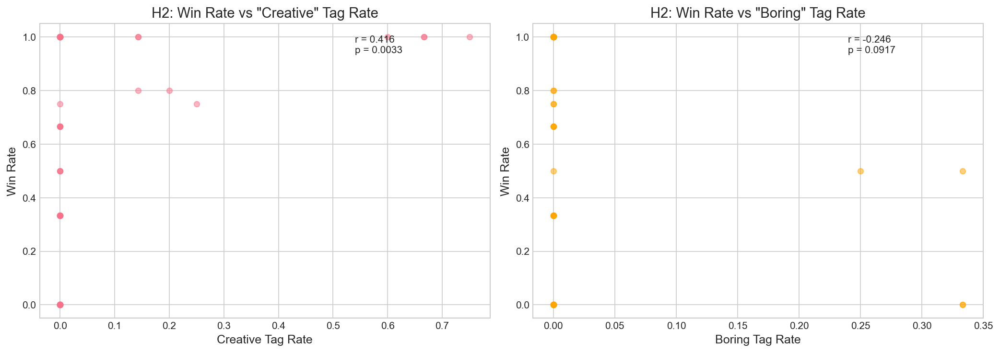
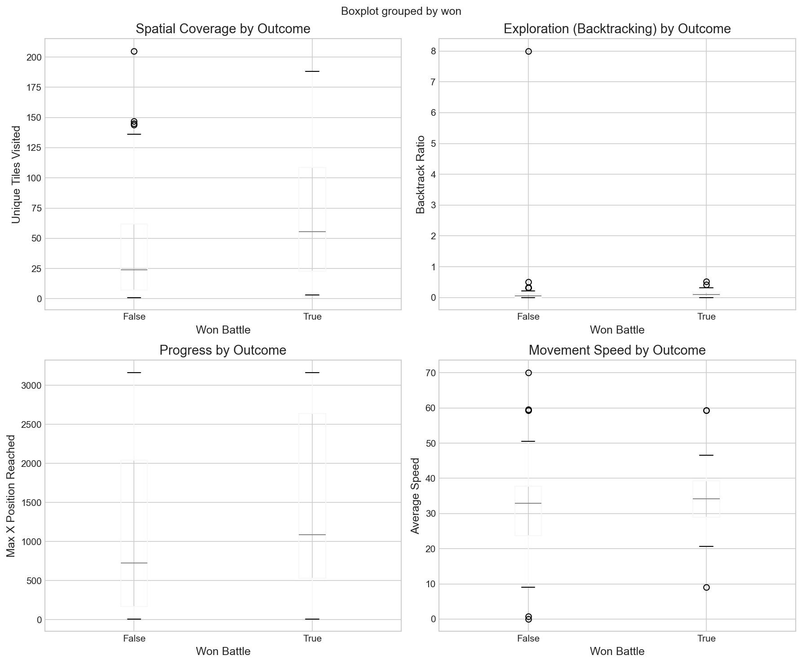
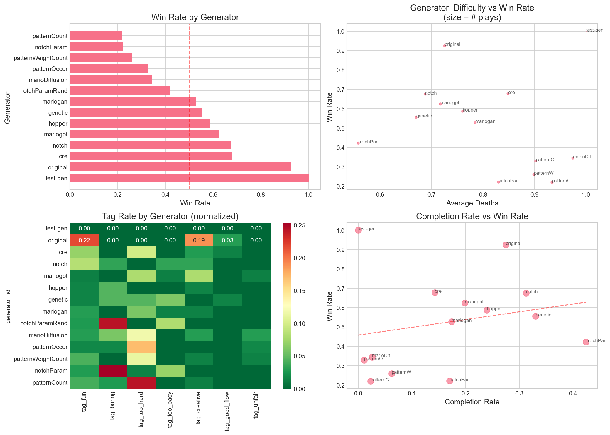

# RQ1: What Makes a Good Generator/Level?

## Executive Summary

This analysis investigates what distinguishes preferred levels and generators in the PCG Arena platform. We tested three hypotheses related to difficulty optimization (H1), structural variety (H2), and player agency/path freedom (H3).

**Key Findings:**
- **H1 (Difficulty)**: Weak negative correlation between difficulty and win rate; no inverted-U pattern found
- **H2 (Variety)**: Significant positive correlation between "creative" tag and win rate (r=0.416, p=0.003)
- **H3 (Agency)**: Winning levels show significantly higher spatial exploration (p=0.004)

---

## H1: Optimized Difficulty (Flow Channel)

### Hypothesis
> Levels with moderate difficulty (15-40% death rate) have higher win rates than levels with 0% or >60% death rates.

### Methods
- Analyzed 48 levels with ≥3 plays
- Computed Spearman correlation between death rate and win rate
- Binned levels by difficulty to test for inverted-U pattern

### Results

| Metric | Value |
|--------|-------|
| Sample Size | 48 levels |
| Spearman r | -0.149 |
| p-value | 0.313 |

**Win Rate by Difficulty Bin:**
| Difficulty (Deaths/Play) | Win Rate |
|--------------------------|----------|
| 0-0.5 | 76.9% |
| 0.5-1 | 54.7% |
| 1+ | Insufficient data |

### Interpretation
- **H1: NOT SUPPORTED** - No inverted-U pattern detected
- Lower difficulty correlates with higher win rate (linear, not quadratic)
- Limited data in higher difficulty bins prevents full analysis
- Players may simply prefer easier levels over "optimal" challenge

---

## H2: Structural Variety

### Hypothesis
> Levels with higher variance in terrain height and more distinct enemy types are preferred over flat or repetitive levels.

### Methods
- Used tag-based proxies since structural features are null in current export
- Computed correlation between "creative"/"boring" tag rates and win rates

### Results

| Tag Correlation | Spearman r | p-value | Significance |
|-----------------|------------|---------|--------------|
| Creative → Win Rate | 0.416 | 0.003** | Yes |
| Boring → Win Rate | -0.246 | 0.092 | Marginal |

**Tag Distribution:**
- Levels tagged "creative": 9 (18.8%)
- Levels tagged "boring": 4 (8.3%)

### Interpretation
- **H2: PARTIALLY SUPPORTED** - Creative levels strongly preferred
- "Creative" tag shows significant positive correlation with winning
- "Boring" tag shows expected negative direction, near significance
- Direct structural metrics needed for full validation

---

## H3: Path Freedom (Agency)

### Hypothesis
> Players prefer levels that allow for more exploration (higher spatial coverage in trajectories) rather than strict linear paths.

### Methods
- Merged trajectory features with vote outcomes
- Compared trajectory metrics between won/lost levels using Mann-Whitney U test

### Results

| Metric | Won Mean | Lost Mean | U-statistic | p-value |
|--------|----------|-----------|-------------|---------|
| **Unique Tiles Visited** | 68.71 | 42.10 | 1486.5 | **0.004** |
| **Backtrack Ratio** | 0.13 | 0.21 | 1401.5 | **0.024** |
| **Max X Reached** | 1532.92 | 1094.78 | 1380.0 | **0.038** |
| Avg Speed | 34.29 | 31.85 | 1249.0 | 0.272 |

### Interpretation
- **H3: STRONGLY SUPPORTED**
- Winning levels have 63% more unique tiles visited (significant)
- Lower backtrack ratio in winners suggests smoother flow
- Winners progress further horizontally (better level design allows progress)
- Speed difference not significant (gameplay pace is consistent)

---

## Generator Rankings

Top-performing generators by win rate (excluding single-game test-gen):

| Rank | Generator | Win Rate | Avg Deaths | Completion Rate |
|------|-----------|----------|------------|-----------------|
| 1 | original | 92.5% | 0.73 | 27.5% |
| 2 | ore | 67.8% | 0.85 | 14.2% |
| 3 | notch | 67.5% | 0.69 | 31.3% |
| 4 | mariogpt | 62.4% | 0.72 | 19.8% |
| 5 | hopper | 58.7% | 0.76 | 24.0% |

**Bottom performers:**
- patternCount (22.0%)
- notchParam (22.1%)
- patternWeightCount (25.9%)

### Generator Correlation Matrix

|                  | win_rate | avg_deaths | completion_rate |
|------------------|----------|------------|-----------------|
| win_rate         | 1.00     | -0.15      | 0.22           |
| avg_deaths       | -0.15    | 1.00       | -0.97          |
| completion_rate  | 0.22     | -0.97      | 1.00           |

**Insight:** Completion rate and deaths are highly inversely correlated (-0.97), but neither strongly predicts win rate at the generator level.

---

## Summary of Findings

| Hypothesis | Outcome | Key Evidence |
|------------|---------|--------------|
| H1: Flow Channel | ❌ Not Supported | Linear (not U-shaped) difficulty effect |
| H2: Structural Variety | ✅ Partially Supported | Creative tag r=0.42, p<0.01 |
| H3: Path Freedom | ✅ Strongly Supported | Spatial coverage p<0.01 |

---

## Limitations

1. **Sample Size**: Only 48 levels with ≥3 plays for robust analysis
2. **Missing Features**: Structural level features (enemy_density, gap_count, height_variance) are null
3. **Tag Sparsity**: Few levels tagged with specific attributes
4. **Trajectory Sample**: Only 100 trajectory records available

---

## Recommendations

1. **Enable structural feature extraction** in level stats export
2. **Collect more votes** to increase power for difficulty analysis
3. **Encourage tagging** to improve proxy-based analyses
4. **Export more trajectories** for path analysis depth

---

*Analysis conducted: 2024*
*Data source: PCG Arena exports (level-stats.json, votes.json, trajectories.json)*
