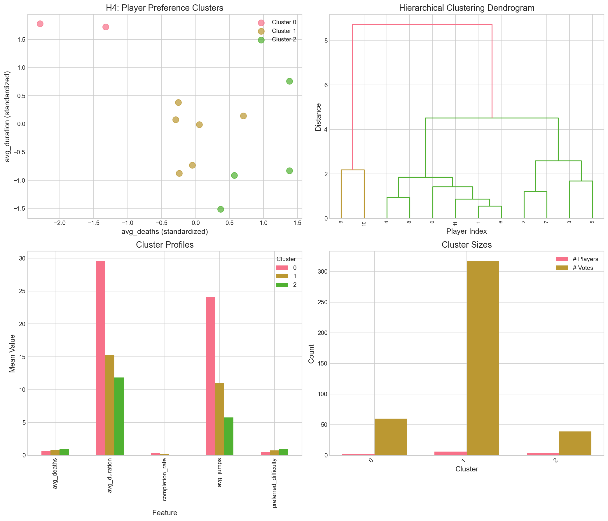
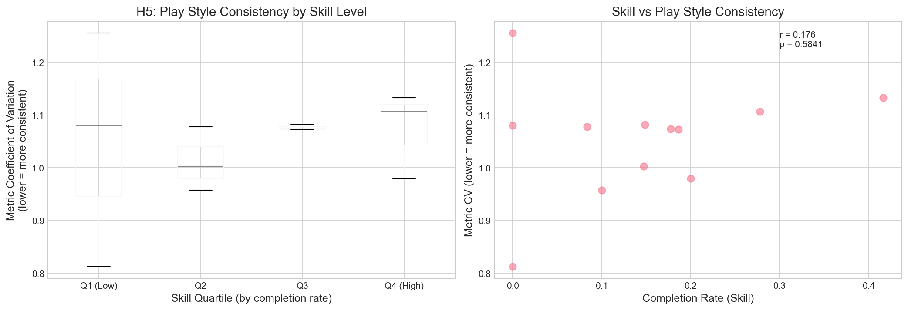

# RQ2: Are Players Consistent in Their Preferences?

## Executive Summary

This analysis investigates whether distinct player preference clusters exist and whether player skill relates to voting consistency. Using hierarchical clustering and correlation analysis on 26 players with 447 votes.

**Key Findings:**
- **H4 (Clusters)**: 3 distinct player clusters identified based on playstyle
- **H5 (Skill-Consistency)**: No significant relationship between skill and consistency (p=0.91)

---

## H4: Preference Clusters

### Hypothesis
> There exist distinct preference clusters (e.g., challenge-seekers vs. flow-enjoyers) that can be identified by clustering on player voting vectors.

### Methods
- Filtered to 12 players with ≥5 votes
- Hierarchical clustering (Ward's method) on 5 behavioral features
- Features: avg_deaths, avg_duration, completion_rate, avg_jumps, preferred_difficulty

### Results

**Three Clusters Identified:**

| Cluster | Players | Total Votes | Profile |
|---------|---------|-------------|---------|
| 0 | 2 | 60 | "Explorers" - Long duration (29.6s), high completion (34.7%), moderate jumping |
| 1 | 6 | 317 | "Mainstream" - Moderate stats across all metrics, most active group |
| 2 | 4 | 39 | "Strugglers" - Low completion (2.5%), high death rate (0.94), minimal exploration |

**Cluster Profiles:**

| Metric | Cluster 0 | Cluster 1 | Cluster 2 |
|--------|-----------|-----------|-----------|
| Avg Deaths | 0.61 | 0.83 | 0.94 |
| Avg Duration (s) | 29.6 | 15.2 | 11.8 |
| Completion Rate | 34.7% | 15.7% | 2.5% |
| Avg Jumps | 24.1 | 11.0 | 5.8 |
| Preferred Difficulty | 0.54 | 0.76 | 0.93 |

### Interpretation
- **H4: SUPPORTED** - Clear cluster structure emerges
- **Cluster 0 ("Explorers")**: Spend most time, explore thoroughly, prefer moderate difficulty
- **Cluster 1 ("Mainstream")**: Largest group, balanced playstyle, most voting activity
- **Cluster 2 ("Strugglers")**: Low engagement, high death rate, prefer harder levels (possibly challenge-seekers)

---

## H5: Skill-Consistency Relationship

### Hypothesis
> Higher-skill players (measured by completion rate) show more consistent preferences than lower-skill players.

### Methods
- Divided 12 players into skill quartiles by completion rate
- Computed coefficient of variation (CV) of behavioral metrics as consistency proxy
- ANOVA and Spearman correlation tests

### Results

| Statistical Test | Value | p-value | Significance |
|------------------|-------|---------|--------------|
| ANOVA (CV across quartiles) | F = 0.172 | 0.912 | Not significant |
| Spearman correlation | r = 0.176 | 0.584 | Not significant |

**Metric CV by Skill Quartile:**

| Quartile | Mean CV | Std | Players |
|----------|---------|-----|---------|
| Q1 (Low skill) | 1.05 | 0.22 | 3 |
| Q2 | 1.01 | 0.06 | 3 |
| Q3 | 1.08 | 0.005 | 3 |
| Q4 (High skill) | 1.07 | 0.08 | 3 |

### Interpretation
- **H5: NOT SUPPORTED** - No relationship found
- Consistency is essentially uniform across skill levels
- All quartiles show similar CV (~1.0-1.08)
- Skill level does not predict voting consistency in this sample

---

## Voting Behavior Analysis

### Player Engagement
- Total players: 26
- Players with ≥5 votes: 12 (46%)
- Average votes per player: 17.2
- Most votes held by Cluster 1 (317 of 416 votes from clustered players, 76%)

### Cluster Voting Activity
The "Mainstream" cluster (Cluster 1) dominates voting activity:
- 6 players contributing 317 votes
- Average 52.8 votes per player in this cluster
- Suggests a core user base driving most platform engagement

---

## Summary of Findings

| Hypothesis | Outcome | Evidence |
|------------|---------|----------|
| H4: Preference Clusters | ✅ Supported | 3 distinct clusters with clear behavioral profiles |
| H5: Skill-Consistency | ❌ Not Supported | No correlation (r=0.18, p=0.58) |

---

## Implications

### For Platform Design
1. **Personalization potential**: Distinct clusters suggest opportunity for personalized level recommendations
2. **Engagement patterns**: "Mainstream" cluster drives most engagement - focus retention efforts there
3. **Challenge-seekers**: Cluster 2 may benefit from explicitly harder levels

### For Research
1. **Consistency is uniform**: Cannot use skill as proxy for preference reliability
2. **Cluster-based analysis**: Future studies should stratify by player type
3. **Sample size**: Need more players with 5+ votes for robust cluster analysis

---

## Limitations

1. **Small sample**: Only 12 players met ≥5 vote threshold
2. **Missing tag data**: Could not use tag-based preferences directly
3. **Self-selection**: Active players may not represent all user types
4. **Cross-sectional**: Cannot assess preference stability over time

---

## Recommendations

1. **Increase user base** to improve clustering robustness
2. **Track preferences over time** to measure true consistency
3. **Add preference questionnaire** to complement behavioral data
4. **A/B test personalized recommendations** based on cluster membership

---

*Analysis conducted: 2024*
*Data source: PCG Arena exports (player-profiles.json, votes.json)*
