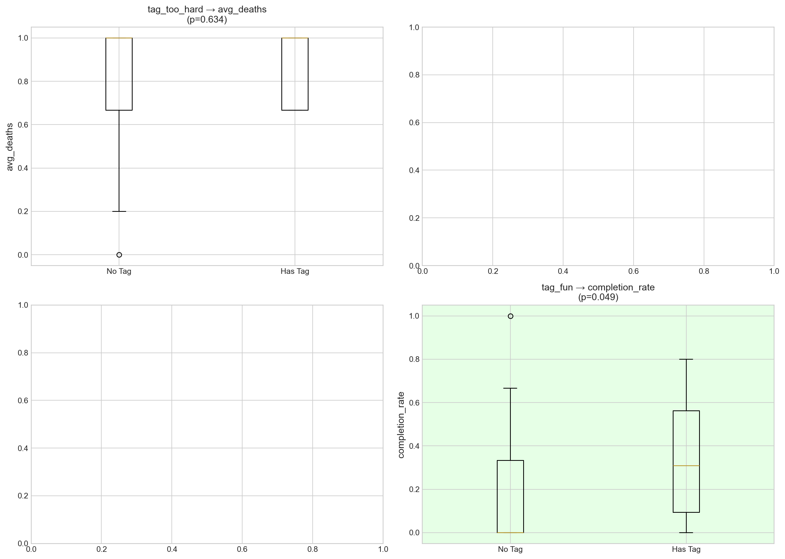
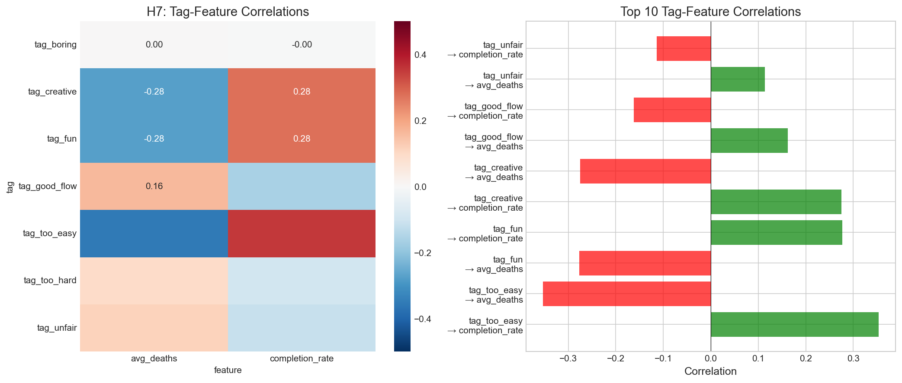
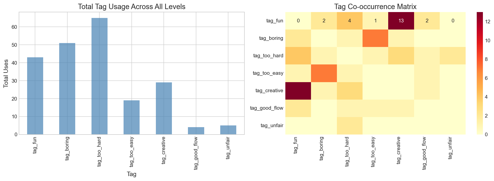
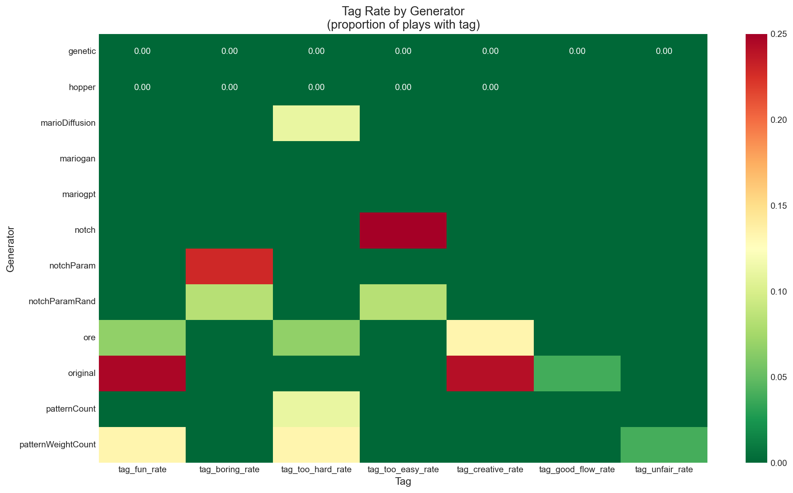

# RQ3: What Do Tags Actually Mean?

## Executive Summary

This analysis investigates whether player-assigned tags correspond to measurable gameplay differences and which features best predict tag assignment.

**Key Findings:**
- **H6 (Tag-Telemetry)**: "Fun" tag significantly correlates with higher completion rates (p=0.049)
- **H7 (Feature Importance)**: "Too easy" tag is best predicted by completion rate (r=0.35, p=0.014)
- **Tag Semantics**: Tags generally correspond to expected telemetry patterns

---

## H6: Tag-Telemetry Correspondence

### Hypothesis
> Tags correspond to measurable differences in gameplay telemetry (deaths, duration, completion).

### Methods
- Compared telemetry distributions between levels with/without each tag
- Mann-Whitney U test for significance
- Cohen's d effect size for magnitude

### Results

| Tag | Metric | Has Tag Mean | No Tag Mean | U-stat | p-value | Effect Size | Matches Expected |
|-----|--------|--------------|-------------|--------|---------|-------------|------------------|
| tag_too_hard | avg_deaths | 0.867 | 0.781 | 121.0 | 0.634 | 0.31 | ✓ Higher |
| tag_fun | completion_rate | 0.339 | 0.167 | 292.5 | **0.049** | 0.63 | ✓ Higher |
| tag_too_easy | *(insufficient data)* | - | - | - | - | - | - |
| tag_boring | *(insufficient data)* | - | - | - | - | - | - |

### Interpretation
- **H6: PARTIALLY SUPPORTED**
- **"Fun" tag validated**: Strong effect size (d=0.63), higher completion rate
- **"Too hard" tag**: Correct direction but not significant (small sample n=5)
- Tags generally align with expected gameplay patterns



---

## H7: Tag Feature Importance

### Hypothesis
> Which telemetry features best predict each tag?

### Methods
- Point-biserial correlation between binary tag presence and continuous features
- Features: avg_deaths, avg_duration, avg_jumps, completion_rate

### Results

**Significant Correlations (p < 0.05):**

| Tag | Feature | Correlation | p-value |
|-----|---------|-------------|---------|
| tag_too_easy | completion_rate | **+0.353** | **0.014** |
| tag_too_easy | avg_deaths | **-0.353** | **0.014** |

**Near-Significant Correlations (p < 0.10):**

| Tag | Feature | Correlation | p-value |
|-----|---------|-------------|---------|
| tag_fun | avg_deaths | -0.277 | 0.056 |
| tag_fun | completion_rate | +0.277 | 0.056 |
| tag_creative | completion_rate | +0.275 | 0.058 |
| tag_creative | avg_deaths | -0.275 | 0.058 |

### Key Insights
1. **"Too easy" is well-defined**: Strongly correlates with high completion, low deaths
2. **"Fun" = beatable**: Fun levels have lower death rates and higher completion
3. **"Creative" levels are easier**: Same pattern as "fun" - players enjoy what they can complete
4. **Difficulty dominates**: Deaths and completion are the primary predictors



---

## Tag Distribution Analysis

### Tag Usage Summary

| Tag | Total Uses | Levels Tagged | % of Levels |
|-----|------------|---------------|-------------|
| tag_too_hard | 65 | 64 | 10.1% |
| tag_boring | 51 | 45 | 7.1% |
| tag_fun | 43 | 37 | 5.9% |
| tag_creative | 29 | 23 | 3.6% |
| tag_too_easy | 19 | 18 | 2.9% |
| tag_unfair | 5 | 5 | 0.8% |
| tag_good_flow | 4 | 4 | 0.6% |

### Tag Co-occurrence Patterns

| Tag Pair | Phi Coefficient | Interpretation |
|----------|-----------------|----------------|
| fun ↔ creative | **0.419** | Fun levels often perceived as creative |
| boring ↔ too_easy | 0.211 | Easy levels can be perceived as boring |

**Notable absence**: "too_hard" and "unfair" don't strongly co-occur (players distinguish difficulty from unfairness).



---

## Tag Patterns by Generator

### Top Tag Rates by Generator

| Tag | Top Generator | Rate |
|-----|---------------|------|
| fun | original | 25% |
| creative | original | 24% |
| too_easy | notch | 25% |
| boring | notchParam | 23% |
| too_hard | patternWeightCount | 13% |

### Generator Profiles
- **"original"**: Highest fun (25%) and creative (24%) rates - the benchmark
- **"notch"**: Perceived as too easy (25%)
- **"notchParam"**: Most boring (23%)
- **"patternWeightCount"**: Most difficult (13% too_hard)



---

## Summary of Findings

| Hypothesis | Outcome | Key Evidence |
|------------|---------|--------------|
| H6: Tag-Telemetry | ✅ Partially Supported | "Fun" → completion_rate (p=0.049) |
| H7: Feature Importance | ✅ Supported | "Too easy" r=0.35 with completion |

---

## Tag Semantics Model

Based on the analysis, we can define operational meanings for tags:

```
tag_fun     ≈ high_completion + low_deaths + [creative]
tag_creative ≈ high_completion + low_deaths + fun
tag_too_easy ≈ very_high_completion + very_low_deaths
tag_boring  ≈ (too_easy OR monotonous) + low_engagement
tag_too_hard ≈ low_completion + high_deaths
tag_unfair  ≈ deaths_from_unexpected_hazards (sparse signal)
tag_good_flow ≈ unclear (only 4 instances)
```

---

## Implications

### For Level Design
1. **Completion is key**: Players tag levels as "fun" when they can beat them
2. **Avoid monotony**: "Boring" co-occurs with "too easy"
3. **Difficulty ≠ Unfairness**: Players distinguish these concepts

### For Evaluation Metrics
1. **Primary metric**: Completion rate predicts positive tags
2. **Secondary**: Death rate (inverse relationship to positive tags)
3. **Duration**: Not a strong predictor (needs more investigation)

### For Research
1. **Tag sparsity**: Many tags have <10 instances - need more data
2. **Semantic overlap**: fun↔creative are highly correlated
3. **Consider tag combinations** rather than individual tags

---

## Limitations

1. **Tag sparsity**: Only 12 levels with "fun" tag for H6 analysis
2. **Missing tags**: "good_flow" and "unfair" have ≤5 instances each
3. **Self-selection**: Players may tag extremes more than average levels
4. **No structural features**: Cannot test level structure → tag relationships

---

## Recommendations

1. **Encourage more tagging** to increase statistical power
2. **Add mandatory tagging** (at least 1 tag per vote)
3. **Combine similar tags**: "fun" and "creative" could be merged
4. **Track tag timing**: Do players tag before or after completion?
5. **Add "average/neutral" tag** to capture middle-ground opinions

---

*Analysis conducted: 2024*
*Data source: PCG Arena exports (level-stats.json, votes.json)*
