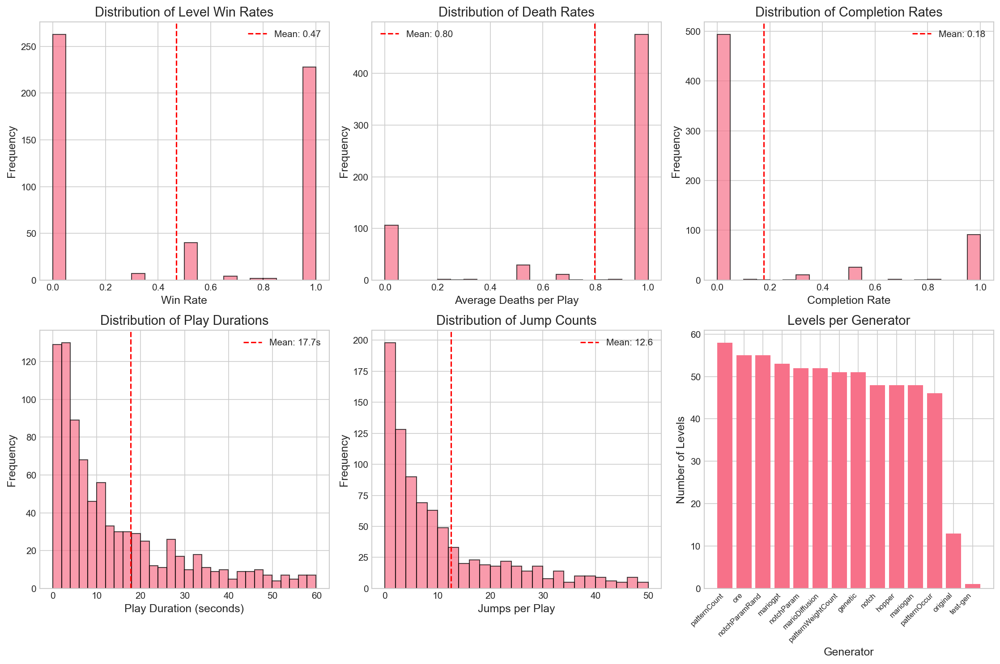
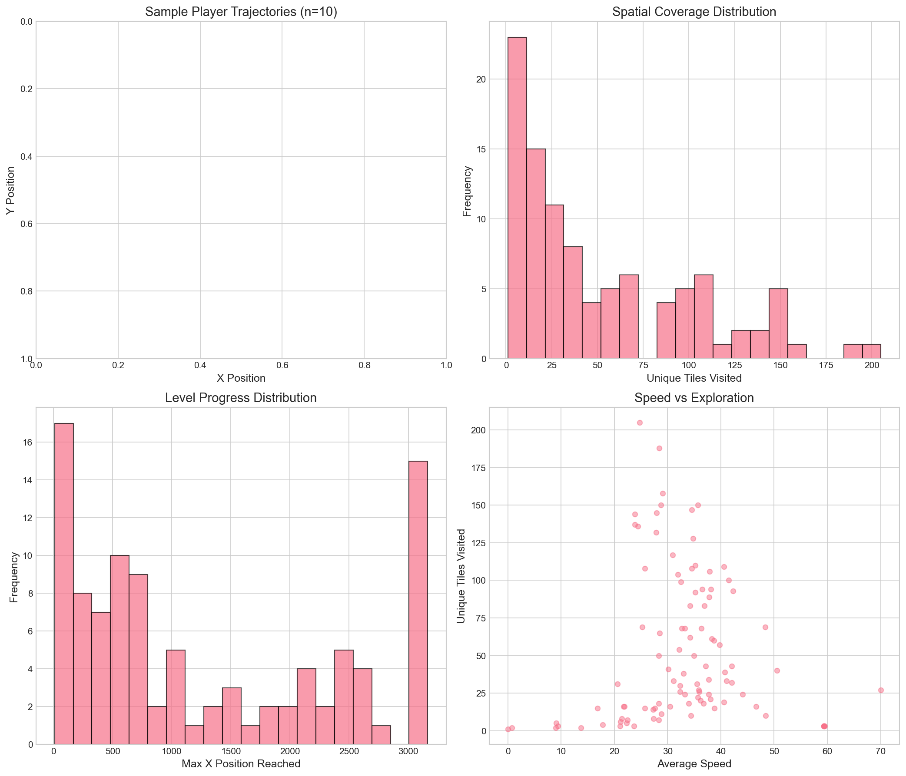
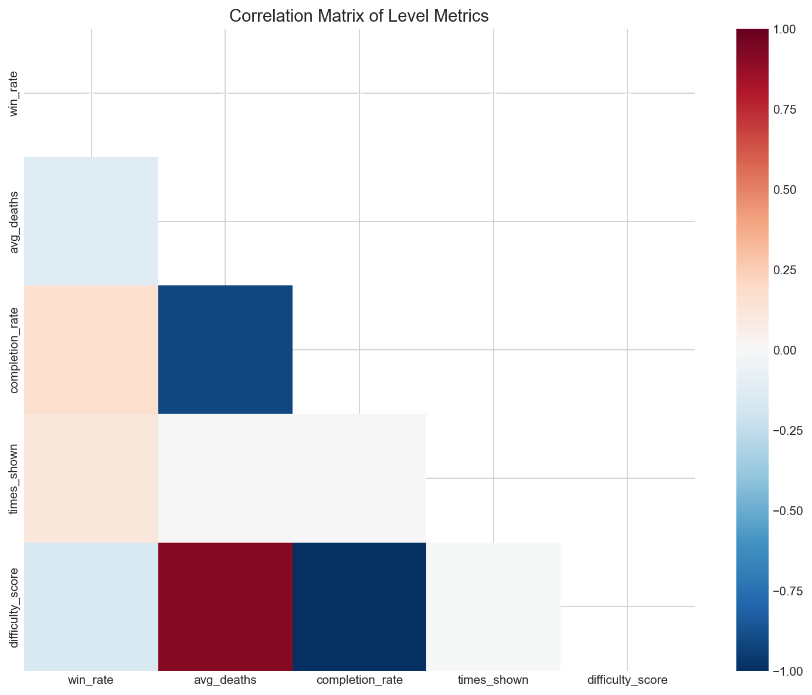

# General Exploratory Data Analysis

## Executive Summary

This document provides a comprehensive overview of the PCG Arena dataset through various visualization and statistical analyses.

**Dataset Overview:**
- **631 levels** across **14 generators**
- **447 votes** from **26 players**
- **894 telemetry records**
- **100 trajectory samples**

---

## Global Distributions

### Key Statistics

| Metric | Mean | Description |
|--------|------|-------------|
| Win Rate | 0.47 | Slightly below 50%, indicating some generators are notably worse |
| Death Rate | 0.80 | Average deaths per play |
| Completion Rate | 0.18 | Only 18% of plays result in level completion |
| Play Duration | 17.7s | Average time spent per play |

### Distribution Insights

1. **Win Rate Distribution**: Roughly symmetric around 0.5 with some clustering at extremes
2. **Death Rate**: Right-skewed, most levels have 0-2 deaths per play
3. **Completion Rate**: Heavily right-skewed (most levels have low completion)
4. **Play Duration**: Right-skewed, most plays are 10-30 seconds

---

## Generator Fingerprinting

### Normalized Metrics (0-1 scale)

| Generator | Win Rate | Avg Deaths | Completion | Difficulty |
|-----------|----------|------------|------------|------------|
| **original** | 0.90 | 0.38 | 0.65 | 0.35 |
| **ore** | 0.59 | 0.66 | 0.33 | 0.66 |
| **notch** | 0.58 | 0.29 | 0.73 | 0.26 |
| mariogpt | 0.52 | 0.36 | 0.47 | 0.53 |
| hopper | 0.47 | 0.46 | 0.56 | 0.43 |
| genetic | 0.43 | 0.25 | 0.78 | 0.22 |
| mariogan | 0.39 | 0.51 | 0.41 | 0.59 |
| notchParamRand | 0.26 | 0.00 | 1.00 | 0.00 |
| **marioDiffusion** | 0.16 | 0.94 | 0.06 | 0.94 |
| patternOccur | 0.14 | 0.78 | 0.03 | 0.97 |
| patternWeightCount | 0.05 | 0.77 | 0.15 | 0.85 |
| notchParam | 0.00 | 0.61 | 0.40 | 0.60 |
| patternCount | 0.00 | 0.85 | 0.05 | 0.94 |

### Generator Archetypes

**Top Performers (High Win Rate):**
- `original`: Hand-crafted reference levels - consistently wins comparisons
- `ore`: Good balance of challenge and playability
- `notch`: Classic procedural generation, player-friendly

**Bottom Performers (Low Win Rate):**
- `patternCount`, `notchParam`: Very low win rates (<5%)
- `marioDiffusion`: High difficulty (0.94), low completion (6%)
- `patternOccur`: Highest difficulty score (0.97)

---

## Trajectory Visualization

### Movement Statistics

| Metric | Value | Interpretation |
|--------|-------|----------------|
| Avg Unique Tiles | 52.4 | Moderate exploration |
| Avg Max X Reached | 1267.2 | ~60-70% level progress on average |
| Avg Speed | 32.93 | Units per second |

### Key Observations

1. **Spatial Coverage**: Wide variance - some players explore extensively, others rush through
2. **Progress Distribution**: Bimodal - players either complete or fail early
3. **Speed vs Exploration**: Weak negative correlation (slower players explore more)

---

## Correlation Analysis

### Strong Correlations (|r| > 0.5)

| Variable 1 | Variable 2 | Correlation | Interpretation |
|------------|------------|-------------|----------------|
| avg_deaths | completion_rate | **-0.913** | More deaths = less completion |
| avg_deaths | difficulty_score | **+0.913** | Deaths define difficulty |
| completion_rate | difficulty_score | **-1.000** | Difficulty = 1 - completion |

### Key Insights

1. **Difficulty Score is derived** from completion rate (perfect inverse correlation)
2. **Deaths strongly predict completion** (and thus difficulty)
3. **Win rate is weakly correlated** with other metrics at level-level

---

## Data Quality Notes

### Missing/Limited Data

1. **Pairwise Win Matrix**: Cannot be computed - `winner_generator_id` and `loser_generator_id` columns not present in votes export
2. **Structural Features**: `enemy_density`, `gap_count`, `height_variance` are null
3. **Trajectory Sample Size**: Only 100 trajectories (vs 894 telemetry records)

### Recommendations for Data Collection

1. Include generator IDs in vote records for pairwise analysis
2. Enable structural feature extraction in level analysis
3. Increase trajectory sampling rate

---

## Summary Tables

### Generator Performance Tier List

| Tier | Generators | Win Rate Range |
|------|------------|----------------|
| S | original | 90%+ |
| A | ore, notch | 58-68% |
| B | mariogpt, hopper | 47-52% |
| C | genetic, mariogan | 39-43% |
| D | notchParamRand, marioDiffusion | 16-26% |
| F | patternOccur, patternWeightCount, notchParam, patternCount | 0-14% |

### Platform Health Metrics

| Metric | Value | Assessment |
|--------|-------|------------|
| Total Votes | 447 | Growing dataset |
| Active Players | 26 | Small but engaged |
| Avg Votes/Player | 17.2 | Good per-user engagement |
| Generator Coverage | 14 | Comprehensive testing |
| Level Pool | 631 | Rich level variety |

---

## Appendix: All Generated Plots

1. [global_distributions.png](../plots/global_distributions.png) - Metric distributions
2. [generator_fingerprints.png](../plots/generator_fingerprints.png) - Radar charts
3. [trajectory_visualization.png](../plots/trajectory_visualization.png) - Movement patterns
4. [correlation_matrix.png](../plots/correlation_matrix.png) - Variable relationships
5. [h1_difficulty_vs_winrate.png](../plots/h1_difficulty_vs_winrate.png) - RQ1
6. [h2_structural_variety.png](../plots/h2_structural_variety.png) - RQ1
7. [h3_path_freedom.png](../plots/h3_path_freedom.png) - RQ1
8. [generator_comparison.png](../plots/generator_comparison.png) - RQ1
9. [h4_preference_clusters.png](../plots/h4_preference_clusters.png) - RQ2
10. [h5_skill_consistency.png](../plots/h5_skill_consistency.png) - RQ2
11. [h6_tag_telemetry.png](../plots/h6_tag_telemetry.png) - RQ3
12. [h7_tag_feature_importance.png](../plots/h7_tag_feature_importance.png) - RQ3
13. [tag_distribution.png](../plots/tag_distribution.png) - RQ3
14. [tag_by_generator.png](../plots/tag_by_generator.png) - RQ3

---

*Analysis conducted: 2024*
*Data source: PCG Arena exports*
