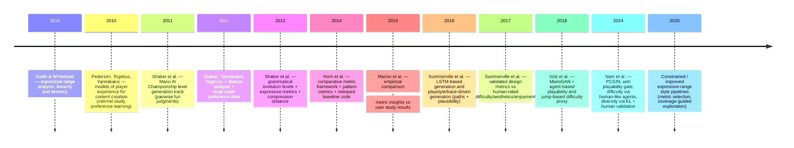

# Evaluation Methods in Super Mario Bros Procedural Content Generation Research

## Executive summary

Evaluation in **Super Mario Bros**-focused procedural content generation (PCG) has evolved from early **“expressive range”** visual analyses using a small set of hand-crafted structural metrics to more diverse pipelines that combine **agent-based solvability**, **difficulty proxies derived from playtraces**, **diversity/similarity measures**, and (less commonly) **human-subject experiments**. citeturn16view0turn22view0turn36view0turn30view0turn37view0turn9view0

Several findings recur across the literature. First, **solvability/playability** is often treated as a *gate* (filtering out unplayable levels) using strong agents—frequently variants of the **A\*** controller family originating in the Mario AI competition community—because it yields fast, scalable, and repeatable checks. citeturn9view0turn37view0turn36view0 Second, many widely used structural metrics (especially **linearity** and **leniency**) were originally designed to characterize generator output spaces rather than to predict human enjoyment, and multiple papers explicitly warn that these metrics are **not interchangeable with human studies**. citeturn16view0turn36view0turn30view0 Third, the domain has gradually expanded from purely static metrics to **simulation-derived metrics** (e.g., jump counts, completion progress, action trajectories) and **human-aligned assessment** (pairwise preferences, Likert judgments, inter-rater bounds), with several papers explicitly validating metrics against human ratings and reporting achievable correlation ceilings. citeturn17view0turn36view0turn30view0turn9view0turn37view0

A core methodological limitation remains: many evaluations depend strongly on **which agent** is used and on **how level representations abstract physics**, creating risks of “agent overfitting” and misalignment with real player experience. citeturn37view0turn9view0turn30view0turn36view0 For a thesis-ready metric suite, the most defensible approach in the Mario PCG domain is a **hybrid**: (a) agent-based playability and difficulty proxies, (b) a small, well-motivated set of structural metrics and diversity measures used primarily for characterization and coverage, and (c) targeted human evaluation (pairwise or Likert) used to *validate* and calibrate the computational metrics rather than replace them. citeturn36view0turn30view0turn17view0turn9view0

## Scope and key milestones in Mario PCG evaluation

Most evaluation methods discussed here are grounded in the ecosystem around the **Mario AI** benchmark/competition lineage and in research-friendly Mario-like clones (often **entity["video_game","Infinite Mario Bros","public domain clone"]**) used to enable controlled experiments, agent playthrough, and web-based human studies at scale. citeturn25view0turn36view0turn17view0turn30view0

A widely cited inflection point is the formalization of **expressive range analysis** by **entity["people","Gillian Smith","pcg researcher"]** and **entity["people","Jim Whitehead","game ai researcher"]**, which established a repeatable pattern: sample many generated levels, compute global metrics, and visualize distributions (often as 2D histograms/heatmaps). citeturn16view0turn14view0 This approach motivated later Mario-focused work that broadened metric sets and released reusable implementations/benchmarks, notably the comparative framework by **entity["people","Britton Horn","computer scientist"] and colleagues, which explicitly positioned metrics as a step toward a common evaluation baseline and released supporting code. citeturn22view0

In parallel, experience-driven research—associated strongly with **entity["people","Julian Togelius","game ai researcher"]**, **entity["people","Georgios N. Yannakakis","game ai researcher"]**, **entity["people","Noor Shaker","pcg researcher"]**, and collaborators—brought rigorous **human preference protocols** (often pairwise) and learned predictors of affective states (engagement, challenge, frustration) into Mario-like environments. citeturn17view0turn25view0turn34view0turn36view0

### Mermaid timeline of key evaluation-focused works



## Metric taxonomy used in Mario PCG evaluation

This section catalogues evaluation metrics appearing repeatedly in Mario PCG papers, grouped by what they measure and how they are typically computed. Where definitions diverge across papers, the differences are called out explicitly.

### Playability, solvability, and validity constraints

**Agent-completion playability (binary or completion fraction).**  
A common baseline is to declare a level playable iff a strong agent completes it; otherwise the level is filtered out, penalized, or assigned worst fitness. For example, in a reinforcement-learning-based generator, levels are “unplayable if [a strong] A* AI agent … cannot complete it,” and downstream criteria are skipped for unplayable levels. citeturn9view0 In GAN+evolution work, playability can be operationalized as progress across the x-axis: if completion fraction *p* < 1, the fitness is penalized; if *p* = 1, additional difficulty proxies apply. citeturn37view0  
Typical thresholds: **p = 1** (full completion) for “solved,” otherwise “unsolved” with penalization; many pipelines simply require **100% solvability of sampled outputs** after filtering, especially when reporting generator quality. citeturn37view0turn9view0  
Pros: scalable, repeatable, inexpensive. Cons: agent bias (superhuman agents may “solve” levels humans cannot; or fail on levels humans find easy due to controller assumptions). citeturn37view0turn9view0turn36view0

> “A level is considered unplayable if this agent cannot complete it.” citeturn9view0

**Physics- or rules-consistency checks and constraint satisfaction.**  
Many constructive generators enforce constraints (e.g., maximum pipe height, gap widths) to guarantee traversability. This appears both in competition entries and in generator descriptions, where “playability constraints” bound parameter choices. citeturn17view0  
Thresholds: domain-specific (e.g., maximum obstacle height) rather than universal; often not standardized across works. citeturn17view0turn36view0  
Pros: guarantees at generation time. Cons: can overly restrict expressive range; may be brittle when ported across engines. citeturn17view0turn22view0

**Reachability of placed elements (objects/items).**  
Reachability metrics quantify whether items/enemies/interactive tiles can be reached or interacted with. In validated platformer-metric work, reachability is defined as a ratio involving unreachable elements (with explicit formulas) and is motivated by the hypothesis that unreachable objects harm perceived quality. citeturn32view0  
Typical thresholds: commonly reported as a proportion in [0,1]; used comparatively rather than as a hard cutoff, though some pipelines treat reachability violations as invalid. citeturn32view0turn30view0  
Pros: captures “obvious” structural flaws. Cons: requires an explicit reachability model (often simplified); depends on movement model fidelity. citeturn32view0turn30view0

**Negative space (reachable empty space).**  
Negative space measures the fraction of empty tiles that are reachable; it is often interpreted as a proxy for meaningful vertical movement and platform variety. citeturn31view0turn32view1  
Pros: relates to traversal affordances beyond mere solvability. Cons: depends on reachability model; can be confounded by sparse levels. citeturn32view1turn30view0

### Difficulty, challenge, and progression proxies

**Leniency (family of definitions; sometimes inverted).**  
Leniency originated as a global characterization metric but has multiple incompatible implementations in Mario research.

*Smith & Whitehead-style component scoring (Launchpad context).* Leniency is defined as a per-beat component score aggregated over a level, with weights chosen by intuition of relative forgiveness (e.g., hazards vs safe jumps). citeturn16view0  
Typical range: often normalized; in Launchpad visualizations it is shown on a roughly **[-1, 1]** axis. citeturn15view1turn16view0  
Pros: simple and interpretable. Cons: hand-tuned weights; not physics-aware; may not correlate with human difficulty judgments. citeturn16view0turn36view0

> “Leniency describes how forgiving the level is likely to be to a player.” citeturn16view0

*Shaker-style chunk-weighted difficulty approximation (Mario-like / IMB context).* In grammatical-evolution evaluation, leniency is computed as a weighted sum over level chunks (gaps, enemies, cannons/flower tubes, powerups), then normalized. citeturn29view0  
Pros: closer to Mario-like obstacle vocabulary. Cons: still hand-weighted; can be gamed by placing “safe” powerups; ignores spatial arrangement interactions. citeturn29view0turn36view0

*Marino/Summerville usage (standardized weights + gap-width adjustment).* In a systematic user-study paper and later metric-validation work, leniency is computed as the sum of object weights (powerups +1, cannons/flower tubes/gaps −0.5, enemies −1) with an additional subtraction of average gap width, then normalized; some works multiply by −1 to align directionality. citeturn36view0turn31view0  
Pros: more standardized in later Mario evaluation papers; easy to implement. Cons: still weakly correlated with human-rated difficulty in at least one user study. citeturn36view0turn30view0

A key empirical takeaway is that leniency—while conceptually aligned with challenge—**only weakly correlates with human difficulty judgments** in at least one controlled evaluation, reinforcing that it should be treated as a descriptive proxy. citeturn36view0turn30view0

**Agent-derived jump count as difficulty proxy.**  
Multiple works use the number of jumps required by an agent to complete a level. In metric-validation research, the A* planner is modified to make jumps more expensive so that it jumps only when necessary, approximating “required” jumps rather than “possible” jumps; jump cost is set to 2 while other actions cost 1. citeturn32view2 In MarioGAN latent-space evolution, jump count is explicitly adopted as an “approximation of experienced difficulty,” with the caveat that the correlation is an assumption. citeturn37view0  
Typical thresholds: used comparatively (more jumps ⇒ harder) or as optimization targets (minimize jumps). MarioGAN-style fitness uses hard feasibility: only if *p* = 1 does the jump term matter. citeturn37view0  
Pros: grounded in traversal; less gameable than raw enemy counts. Cons: agent-policy dependent; corner cases if the agent “gets stuck” or exploits. citeturn37view0turn32view2

> “For an approximation of experienced difficulty, we use the number of jump actions performed by the agent.” citeturn37view0

**Difficulty via “virtual damage” and human-like agent stochasticity.**  
Recent PCGRL evaluation uses a multi-trial evaluation with “human-like” A*-derived agents that model timing inaccuracies. Difficulty is operationalized via “total damage” combining enemy damage and hole damage with a higher hole coefficient (1.1), then mapped through a difficulty-appropriateness function to discourage extremes (too easy/too hard). citeturn9view0turn8view3 Human-subject validation reports correlations between the computed difficulty proxy and Likert difficulty ratings, and a piecewise transformation is used to separate “too easy” vs “too difficult” when the underlying appropriateness score is low at both extremes. citeturn7view0  
Typical thresholds: the difficulty-value transformation uses a condition **totaldmg ≤ 4**. citeturn7view0turn8view0  
Pros: explicitly tries to align simulation with human error; validated against human responses. Cons: stochastic evaluations add variance; may require multiple trials to stabilize. citeturn7view0turn9view0

**Exploration-based difficulty metrics.**  
Some newer objective-metric work (summarized inside later papers) measures difficulty by how much exploration an A* agent performs; diversity can be compared via trajectories of actions. citeturn6view1  
Pros: can detect “decision complexity” beyond jump counts. Cons: sensitive to planner implementation and heuristics. citeturn6view1turn37view0

**Difficulty curves and progression.**  
Competition and experience-driven studies often collect player telemetry (jumps, coins, time running left, etc.) and can support evaluation of whether generated content adapts to player style; however, formal “difficulty curve” metrics vary and are rarely standardized across papers. citeturn17view0turn25view0turn38view0

### Structural geometry and layout characterization

**Linearity (multiple operationalizations).**  
In expressive-range origins, linearity is computed by fitting a line to platform midpoints and aggregating distances; results are normalized so **0 = highly linear** and **1 = highly non-linear**, and values above ~0.7 were rarely observed in the reported experiments. citeturn16view0  
In later Mario benchmark evaluation, linearity can be computed as an **R² goodness-of-fit** to a line fit to platform endpoints, so it behaves as “levels with many height differences have low linearity.” citeturn23view3  
In additional Mario-like comparisons, linearity is computed via regression over platform/mountain centerpoints and aggregated distances, then normalized, sometimes with sign flips for interpretation. citeturn36view0turn31view0turn29view0  
Pros: interpretable high-level geometry summary; useful for expressive-range plots. Cons: does not capture local geometry rhythm; depends on what constitutes a “platform.” citeturn16view0turn36view0turn30view0

> “Results are normalized to [0,1], where 0 is highly linear and 1 is highly non-linear.” citeturn16view0

**Density (stacking / vertical layering).**  
Density is typically defined as how many platforms/mountains are stacked along x-coordinates. One implementation assigns density per position based on the number of possible standing heights and averages over positions. citeturn23view4turn29view0  
Pros: captures vertical complexity. Cons: may not track difficulty directly; can confound with linearity and level length. citeturn29view0turn36view0turn30view0

**Symmetry and balance.**  
Validated metric work introduced symmetry as a composite of positional/area differences across quadrants, and balance metrics comparing weighted distributions between regions. citeturn31view3turn32view0 Notably, symmetry can behave counterintuitively because it can proxy for “object amount” rather than perceived aesthetic quality if the object set size varies. citeturn31view3  
Pros: formalizable and fast. Cons: can be confounded; requires careful interpretation and validation. citeturn31view3turn30view0

**Tile frequency and tile-position summary statistics.**  
Large metric suites compute per-tile-type frequencies, indicator variables, and spatial distribution statistics (means/variances of x/y positions) to capture not just “how much,” but “where” content appears. citeturn32view2turn31view3  
Pros: supports regression-based predictors and diagnosis. Cons: high dimensionality increases multiple-comparisons risk; requires feature selection and cross-validation discipline. citeturn30view0turn32view2

### Diversity, novelty, similarity, and expressive-range style evaluation

**Expressive Range Analysis (ERA) visualizations.**  
ERA is the practice of sampling many outputs and plotting distributions over 2D (or pairwise) metric spaces to reveal peaks and “holes” in what a generator can produce. The method explicitly emphasizes metric choice, large samples, and visualization of biases. citeturn16view0turn23view1turn29view0  
Typical thresholds: sample sizes of **thousands** are common (e.g., 10,000 in the original formulation; 1,000 in later comparative studies), but no universal number exists. citeturn16view0turn29view0  
Pros: strong for comparative characterization and debugging generator biases. Cons: descriptive; does not automatically imply player-perceived quality. citeturn36view0turn22view0

**Compression Distance / Normalized Compression Distance (NCD).**  
Compression-based distances treat two levels as strings; if compressing them together yields little savings, they are deemed dissimilar. A comparative benchmark uses gzip in one implementation. citeturn23view1 A GE-based comparative study uses NCD over event sequences encoding geometry/item events and reports high dissimilarity (e.g., NCD > 0.6 for most pairs). citeturn29view0  
Typical thresholds: **NCD > 0.6** used descriptively to indicate substantial dissimilarity in one study. citeturn29view0  
Pros: domain-general, captures structural repetition beyond tile counts. Cons: sensitive to encoding choices; not inherently semantic (physics/gameplay). citeturn29view0turn23view1

> “Compression distance is a domain-general metric…” citeturn23view1

**Pattern density and pattern variation (meso-pattern metrics).**  
Benchmark-style evaluations search for meso-patterns from original Mario levels and report (a) how many such patterns appear and (b) how varied they are, as proxies for “Mario-like structure” and non-repetitiveness. citeturn23view4turn23view1  
Pros: ties evaluation to human-authored design idioms. Cons: requires a pattern library; may bias evaluation toward imitation. citeturn23view4turn22view0

**Entropy of spatial distributions (enemies/gaps).**  
Competition analysis describes “spatial diversity” of gaps and enemies using entropy computed over counts in equally spaced level segments (e.g., 10 segments). citeturn17view0  
Pros: captures distributional diversity rather than raw counts. Cons: depends on binning choices; ignores local playability interactions. citeturn17view0turn36view0

**KL-divergence as a diversity/similarity indicator.**  
A recent PCGRL evaluation uses KL-divergence between high-dimensional tile-arrangement vectors (after mapping certain tiles to numeric codes) as a diversity indicator between levels, and uses KL-based thresholds within a “diversity-aware greedy policy.” citeturn8view0turn7view0  
Pros: fast, differentiates “arrangement similarity” beyond identical tile counts. Cons: depends on tile encoding and vectorization; can miss gameplay-equivalent variations. citeturn8view0turn7view0

### Human-subject evaluation and human-aligned protocols

**Pairwise preference (forced-choice) on “fun” and related constructs.**  
The Mario AI level-generation track used a two-alternative forced choice (2AFC) design: judges played two generated levels and indicated which was more fun; “fun” was intentionally left undefined to reduce bias. The procedure controlled for order effects by having the same judge play both orders. citeturn17view0  
Typical thresholds: fairness constraints require that entries be compared equally often; minimum judge counts can be derived from the number of pairs (e.g., 6 competitors ⇒ 15 judges minimum for complete pair coverage). citeturn17view0  
Pros: strong comparative signal; robust to scale interpretation differences. Cons: requires participant time; can be noisy; sensitive to short exposure windows. citeturn17view0turn36view0

> “A two-alternative forced-choice questionnaire was used…” citeturn17view0

**Likert ratings of specific criteria + correlation checks.**  
Modern PCGRL work conducted Likert-scale studies (including 7-point difficulty) and reported Pearson correlations between computed criteria and perceived ratings, explicitly validating monotony/difficulty/diversity proxies. citeturn7view0turn9view0  
Pros: criterion-specific validation; supports calibration. Cons: Likert scales can have low inter-rater reliability for aesthetics/enjoyment; requires measurement discipline. citeturn30view0turn7view0

**Large-scale web studies for experience modeling (preference learning).**  
Experience modeling for content creation used an online survey experiment recruiting subjects via web/social media; at the time of writing, 181 subjects had participated, and analyses used 120 subjects (240 game pairs; 480 sessions) with a design ensuring each pair of variants is seen in both orders. citeturn34view0  
A later feature-analysis study reports a “significantly larger data set of 600 human players,” with preferences collected via forced-choice questionnaires over affective states. citeturn25view0  
Pros: scale; supports predictive modeling. Cons: uncontrolled environments; player skill variance; selection effects. citeturn34view0turn25view0

**Human inter-rater agreement as an empirical upper bound for metric prediction.**  
Metric-validation work explicitly measured agreement bounds (same-user vs independent-user correlations) and reported that while difficulty/enjoyment can have moderate agreement, visual aesthetics agreement can be much lower—limiting achievable metric-human correlations. citeturn30view0turn32view5

## Comparative matrix of Mario PCG papers and metrics

Legend (columns): **P** playability/solvability gate; **A** agent-based difficulty/progress; **S** static structure (linearity, density, tile stats); **Dv** diversity/similarity across sets (NCD/KL/entropy); **ER** expressive range visualization; **H** human study; **ML** learning-based predictors of experience/ratings.

| Paper | Year | Venue | Method (very brief) | P | A | S | Dv | ER | H | ML |
|---|---:|---|---|:--:|:--:|:--:|:--:|:--:|:--:|:--:|
| entity["people","Gillian Smith","pcg researcher"] & entity["people","Jim Whitehead","game ai researcher"], “Analyzing the expressive range…” | 2010 | PCG Workshop | Expressive range method; two metrics |  |  | ✓ |  | ✓ |  |  |
| entity["people","Christopher Pedersen","games researcher"] et al., “Modeling Player Experience for Content Creation” | 2010 | Journal/Tech rep | Web study; preference learning models |  |  | ✓ (content params) |  |  | ✓ | ✓ |
| entity["people","Noor Shaker","pcg researcher"] et al., “Mario AI Championship… Level Generation Track” | 2011 | entity["organization","IEEE","professional association"] journal | PCG competition; 2AFC fun |  | ✓ (telemetry) | ✓ (features/entropy) | ✓ |  | ✓ |  |
| Shaker et al., “Feature Analysis for Modeling Game Content Quality” | 2011 | CIG | 600-player preference modeling; content features |  |  | ✓ |  |  | ✓ | ✓ |
| Shaker et al., “Evolving Levels… Grammatical Evolution” | 2012 | CIG | GE generator + expressive metrics + NCD |  |  | ✓ | ✓ | ✓ |  |  |
| entity["people","Britton Horn","computer scientist"] et al., “Comparative Evaluation…” | 2014 | FDG | Benchmark metrics + pattern metrics + NCD |  |  | ✓ | ✓ | ✓ |  |  |
| Dahlskog & Togelius (patterns/n-grams line) | 2014 | FDG/related | Pattern-focused generation/evaluation (cited in later eval works) |  |  | ✓ | ✓ | ✓ |  |  |
| entity["people","Julian R. H. Marino","ai researcher"] et al., “Empirical Evaluation of Evaluation Metrics…” | 2015 | AIIDE | User study vs metrics; 37 participants |  |  | ✓ | ✓ |  | ✓ |  |
| entity["people","Adam Summerville","pcg researcher"] et al., “Learning Player Tailored Content…” | 2016 | AAAI WS | LSTM co-generates levels+paths from video traces | ✓ (path plausibility goal) | ✓ (paths/agents) |  |  |  |  | ✓ |
| Summerville et al., “Understanding Mario…” | 2017 | FDG | 85 metrics; correlations+regression vs human ratings |  | ✓ (A* jumps/path) | ✓ |  |  | ✓ (dataset-based) | ✓ |
| entity["people","Vanessa Volz","ai researcher"] et al., “Evolving Mario Levels in GAN Latent Space” | 2018 | GECCO | GAN + CMA-ES; playability+jumpproxy fitness | ✓ | ✓ | ✓ (tile dist) |  |  |  |  |
| Shi et al., “Online Level Generation… Constructive Primitives” | 2016 | CIG | Online generation; metrics: linearity/density/leniency |  |  | ✓ | ✓ (CD in some) | ✓ |  |  |
| entity["people","Sang-Gyu Nam","ai researcher"] et al., “RL to Generate Levels… Quality & Diversity” | 2024 | ToG | PCGRL; playability gate; human-like agents; KL diversity; human validation | ✓ | ✓ | ✓ | ✓ |  | ✓ (33) |  |
| Schaa et al., “Evaluating the Expressive Range…” | 2024 | Algorithms (MDPI) | Comparative evaluation of open-source generators |  |  | ✓ | ✓ | ✓ |  |  |
| Bazzaz et al., “Constrained Expressive Range…” | 2025 | PCG Workshop | Sampling and coverage in expressive-range space |  |  | ✓ | ✓ | ✓ |  |  |

Notes: Some rows are included for influence/coverage even when the paper is primarily about generation, because their evaluation choices (agent gates, ERA, metric sets) were reused broadly in Mario PCG evaluation practice. citeturn16view0turn22view0turn17view0turn25view0turn29view0turn36view0turn30view0turn37view0turn38view0turn13search14turn3search18turn13search1

## Implementation patterns, reproducibility, and gaps

A “standard” Mario PCG evaluation pipeline has become recognizable: generate many samples, run a playability gate, compute a small set of structural metrics (often linearity/leniency/density), optionally compute diversity metrics (NCD/compression or entropy), and visualize/compare distributions across generators. citeturn16view0turn22view0turn29view0turn36view0 Comparative benchmark work explicitly framed this as a response to ad hoc “evaluation-by-example” and released code to encourage reuse. citeturn22view0

One reproducibility strength of the Mario PCG literature is the repeated use of shared frameworks and open competition software. The Mario AI Championship track notes that competition software was open source and published. citeturn17view0 Likewise, comparative evaluation work explicitly states that supporting code was publicly released as a benchmark. citeturn22view0 MarioGAN latent-space evolution also reports the project being available on GitHub, enabling replication of both generator and fitness definitions. citeturn37view0

The most consistent gaps are methodological rather than infrastructural. First, key metrics are **underspecified and non-standardized** across papers: “leniency” alone appears in materially different forms (component scoring vs chunk weights vs Shaker/Marino formulas), and even “linearity” varies between distance-based regression residuals and R² goodness-of-fit. citeturn16view0turn23view3turn29view0turn36view0turn31view0 This makes cross-paper numerical comparisons hazardous unless the exact implementation is matched. citeturn36view0turn22view0

Second, there is an ongoing **alignment problem**: computational metrics often fail to match human judgments of enjoyment/aesthetics/difficulty unless they incorporate richer, semantically grounded information (agent traces, reachability, distributions of specific objects, etc.). The clearest evidence is the direct comparison study concluding that “current computational metrics should not be used in lieu of user studies” for player perception. citeturn36view0 The later “Understanding Mario” paper reinforces this by embedding human inter-rater limits and showing that some constructs (aesthetics) are inherently noisier than others, capping achievable metric correlations. citeturn30view0turn32view5

Third, many pipelines rely on one or a small number of agents, leading to **agent dependence**: a superhuman optimal controller can yield misleading difficulty estimates, while suboptimal controllers can falsely mark levels unplayable. MarioGAN explicitly uses the 2009 competition-winning A* agent for playability and jump-based difficulty, and notes nondeterminism/outliers requiring averaging multiple simulations. citeturn37view0 PCGRL work goes further by introducing stochastic “human-like” agents and notes that this stochasticity can destabilize evaluation values, requiring more trials or alternative stabilization strategies. citeturn9view0turn7view0

Finally, many evaluations focus on **distributional characterization** (ERA) rather than hypothesis-driven validation. ERA is powerful for debugging generator biases and mapping controllability, but it does not, by itself, establish that a generator produces better experiences. citeturn16view0turn22view0turn36view0

### Mermaid flowchart of a defensible Mario PCG evaluation pipeline

```mermaid
flowchart TD
  A[Define level representation + sampling protocol] --> B[Generate N levels per generator/setting]
  B --> C[Validity gates: parseable + constraints]
  C --> D[Playability gate: strong agent completion]
  D --> E[Static metrics: linearity, density, leniency, tile stats]
  D --> F[Simulation metrics: completion %, jumps, path length, damage, time]
  B --> G[Set-level metrics: diversity (NCD/KL/entropy), novelty vs corpus]
  E --> H[Expressive range plots + coverage stats]
  F --> I[Difficulty bins + robustness checks]
  B --> J[Human study: pairwise A/B + Likert criteria]
  J --> K[Statistics: inter-rater, correlations, effect sizes, calibration]
  H --> L[Report: figures + thresholds + code + seeds]
  G --> L
  I --> L
  K --> L
```

## Recommended metric set and validation experiments for a master’s thesis

The thesis-level recommendation below assumes you want (a) metrics that are **common in Mario PCG**, (b) implementable and reproducible, and (c) scientifically defensible because they are either validated against humans or explicitly framed as descriptive rather than substitutive. citeturn36view0turn30view0turn22view0turn9view0turn37view0

### Recommended metric set with implementation notes

| Goal | Recommended metrics | How to compute (implementation-facing) | Reporting/threshold guidance | Validation experiment |
|---|---|---|---|---|
| Solvability gate | Agent completion (binary) and completion fraction *p* | Run a strong A* agent; report solvability rate and distribution of *p* | Report % solvable; if filtering, report both pre/post-filter counts | Spot-check with human playtests on a stratified sample of “solved by agent” levels |
| Difficulty proxy | Jump count (required jumps) + optional progress time; optionally “damage” proxy if using stochastic/human-like agents | Use A* with higher jump cost to approximate required jumps; or adopt damage-based evaluation with multiple trials | Avoid a single scalar; report quantiles and per-bin summaries | Correlate with human-rated difficulty (Likert 7-point recommended for granularity) |
| Structural characterization | Linearity + density + (one chosen) leniency definition (documented) | Implement exactly one version of each; note whether linearity is distance-based or R²-based; define leniency weights and whether inverted | Avoid cross-paper numeric comparisons unless implementations match; include unit tests or reference outputs | Check whether these metrics predict anything meaningful in your dataset; expect weak-to-moderate correlations for some criteria |
| Diversity across outputs | NCD/compression distance OR KL-over-encoding; plus “% unique levels” | Choose a stable encoding; compute pairwise distances on a sample; summarize mean/median and coverage | Avoid excessive O(N²) by sampling pairs; report encoding and compressor | Human “diversity” judgments on small sets (triplets) as done in KLlevel validation style |
| Expressive-range coverage | ERA plots + coverage statistic (occupied bins) | Sample many levels; compute 2D histograms over two interpretable metrics (e.g., linearity vs leniency) | Treat as characterization; report N and binning choices | Use ERA to guide where you sample for human studies (cover “holes” and “peaks”) |
| Human preference/quality | Pairwise A/B preference + criterion-specific Likert | Use counterbalanced order; store telemetry; avoid defining “fun” too tightly unless needed | Report participant counts, exclusions, and trial counts per condition | Use mixed-effects models or robust stats; compute inter-rater reliability; derive empirical ceilings |
| Learning-based evaluation (optional, thesis-strengthening) | Regression model predicting ratings from metrics | Use cross-validation; feature selection (e.g., LASSO) to avoid overfitting | Report MAE and correlation; compare to baselines | Demonstrate generalization across generators and difficulty bins |

This set explicitly mirrors common Mario PCG practice: strong agent playability gates, jump-based or trace-based difficulty proxies, ERA-style characterization, compression/KL-based diversity, and human validation—exactly the combination that the literature increasingly converges on when rigor is prioritized. citeturn16view0turn22view0turn36view0turn32view2turn37view0turn9view0turn17view0turn30view0

### Suggested thesis experiments to validate and calibrate metrics

A defensible experimental plan—grounded in what Mario PCG papers have shown can and cannot work—would include:

First, run a **metric reliability and sensitivity audit**: generate a large sample per generator (or per parameter setting), compute metrics, and check stability under resampling (bootstrapped confidence intervals). This aligns with the ERA ethos of diagnosing biases and “holes.” citeturn16view0turn22view0turn29view0

Second, perform a **human-alignment study** with two layers. Layer 1 is a broad but shallow study (pairwise A/B “which is more fun” plus a few Likert questions) closely matching the Mario AI Championship track design to reduce cognitive burden and maximize comparisons. citeturn17view0turn34view0 Layer 2 is a smaller, deeper validation set where you collect enough repeated ratings to estimate inter-rater bounds (as “Understanding Mario” does), so you can interpret correlations realistically. citeturn30view0turn32view5

Third, test **agent dependence** directly by evaluating with at least two agents (e.g., a strong A* and a weaker/noisy variant). This follows from evidence that stochastic “human-like” agents can introduce evaluation variance but may better match human difficulty perceptions; quantifying this tradeoff is publishable in itself. citeturn9view0turn7view0turn37view0

Fourth, validate **diversity metrics** with human judgments using *triplet* or *set-based* tasks (“which set is more diverse?”), matching the design used to validate KL-based diversity indicators in modern RL-based generation work. citeturn7view0turn8view0

Finally, if your thesis includes a web platform for evaluation, integrate **adaptive pair selection and ranking** (e.g., Glicko/Elo-like rating systems) and semantic tags to improve data efficiency and interpretability, as described in your provided draft platform work. fileciteturn0file0

## Bibliography and excerptable definitions

### Short excerptable quotes (definitions and protocol snippets)

> “Leniency describes how forgiving the level is likely to be to a player.” citeturn16view0

> “Results are normalized to [0,1], where 0 is highly linear and 1 is highly non-linear.” citeturn16view0

> “Compression distance is a domain-general metric…” citeturn23view1

> “A level is considered unplayable if this agent cannot complete it.” citeturn9view0

> “A two-alternative forced-choice questionnaire was used…” citeturn17view0

> “For an approximation of experienced difficulty, we use the number of jump actions performed by the agent.” citeturn37view0

### APA-style references for cited Mario PCG evaluation papers

```text
Horn, B., Dahlskog, S., Shaker, N., Smith, G., & Togelius, J. (2014). A comparative evaluation of procedural level generators in the Mario AI framework. In Proceedings of the Foundations of Digital Games Conference (FDG).

Marino, J. R. H., Reis, W. M. P., & Lelis, L. H. S. (2015). An empirical evaluation of evaluation metrics of procedurally generated Mario levels. In Proceedings of the AAAI Conference on Artificial Intelligence and Interactive Digital Entertainment (AIIDE).

Nam, S.-G., Hsueh, C.-H., Rerkjirattikal, P., & Ikeda, K. (2024). Using reinforcement learning to generate levels of Super Mario Bros. with quality and diversity. IEEE Transactions on Games, 16(4), 807–820. https://doi.org/10.1109/TG.2024.3416472

Pedersen, C., Togelius, J., & Yannakakis, G. N. (2010). Modeling player experience for content creation. IEEE Transactions on Computational Intelligence and AI in Games.

Shaker, N., Togelius, J., Yannakakis, G. N., Weber, B., Shimizu, T., Hashiyama, T., Sorenson, N., Pasquier, P., Mawhorter, P., Takahashi, G., Smith, G., & Baumgarten, R. (2011). The 2010 Mario AI championship: Level generation track. IEEE Transactions on Computational Intelligence and AI in Games, 3(4), 332–347.

Shaker, N., Yannakakis, G. N., & Togelius, J. (2011). Feature analysis for modeling game content quality. In Proceedings of the IEEE Conference on Computational Intelligence and Games (CIG).

Shaker, N., Nicolau, M., Yannakakis, G. N., Togelius, J., & O’Neill, M. (2012). Evolving levels for Super Mario Bros using grammatical evolution. In Proceedings of the IEEE Conference on Computational Intelligence and Games (CIG).

Smith, G., & Whitehead, J. (2010). Analyzing the expressive range of a level generator. In Proceedings of the Workshop on Procedural Content Generation in Games (PCGames ’10). ACM.

Summerville, A., Marino, J. R. H., Snodgrass, S., Ontañón, S., & Lelis, L. H. S. (2017). Understanding Mario: An evaluation of design metrics for platformers. In Proceedings of the Foundations of Digital Games (FDG).

Summerville, A., & Mateas, M. (2016). Learning player tailored content from observation: Platformer level generation from video traces using LSTMs. In Experimental AI in Games (AIIDE Workshop). AAAI Technical Report.

Volz, V., Schrum, J., Liu, J., Lucas, S. M., Smith, A., & Risi, S. (2018). Evolving Mario levels in the latent space of a deep convolutional generative adversarial network. In Proceedings of the Genetic and Evolutionary Computation Conference (GECCO).
```

### BibTeX entries for quick thesis integration

```bibtex
@inproceedings{SmithWhitehead2010ExpressiveRange,
  title={Analyzing the expressive range of a level generator},
  author={Smith, Gillian and Whitehead, Jim},
  booktitle={Proceedings of the Workshop on Procedural Content Generation in Games (PCGames '10)},
  year={2010},
  organization={ACM}
}

@inproceedings{HornEtAl2014Comparative,
  title={A Comparative Evaluation of Procedural Level Generators in the Mario AI Framework},
  author={Horn, Britton and Dahlskog, Steve and Shaker, Noor and Smith, Gillian and Togelius, Julian},
  booktitle={Proceedings of the Foundations of Digital Games Conference (FDG)},
  year={2014}
}

@inproceedings{ShakerEtAl2011MarioAITrack,
  title={The 2010 Mario AI Championship: Level Generation Track},
  author={Shaker, Noor and Togelius, Julian and Yannakakis, Georgios N. and Weber, Ben and Shimizu, Tomoyuki and Hashiyama, Tomonori and Sorenson, Nathan and Pasquier, Philippe and Mawhorter, Peter and Takahashi, Glen and Smith, Gillian and Baumgarten, Robin},
  booktitle={IEEE Transactions on Computational Intelligence and AI in Games},
  year={2011},
  volume={3},
  number={4},
  pages={332--347}
}

@inproceedings{ShakerEtAl2011FeatureAnalysis,
  title={Feature Analysis for Modeling Game Content Quality},
  author={Shaker, Noor and Yannakakis, Georgios N. and Togelius, Julian},
  booktitle={Proceedings of the IEEE Conference on Computational Intelligence and Games (CIG)},
  year={2011}
}

@inproceedings{ShakerEtAl2012GrammaticalEvolution,
  title={Evolving Levels for Super Mario Bros Using Grammatical Evolution},
  author={Shaker, Noor and Nicolau, Miguel and Yannakakis, Georgios N. and Togelius, Julian and O'Neill, Michael},
  booktitle={Proceedings of the IEEE Conference on Computational Intelligence and Games (CIG)},
  year={2012}
}

@inproceedings{MarinoReisLelis2015EmpiricalMetrics,
  title={An Empirical Evaluation of Evaluation Metrics of Procedurally Generated Mario Levels},
  author={Marino, Julian R. H. and Reis, William M. P. and Lelis, Levi H. S.},
  booktitle={Proceedings of the AAAI Conference on Artificial Intelligence and Interactive Digital Entertainment (AIIDE)},
  year={2015}
}

@inproceedings{SummervilleEtAl2017UnderstandingMario,
  title={Understanding Mario: An Evaluation of Design Metrics For Platformers},
  author={Summerville, Adam and Marino, Julian R. H. and Snodgrass, Sam and Ontanon, Santiago and Lelis, Levi H. S.},
  booktitle={Proceedings of the Foundations of Digital Games (FDG)},
  year={2017}
}

@inproceedings{SummervilleMateas2016LSTMs,
  title={Learning Player Tailored Content From Observation: Platformer Level Generation from Video Traces Using LSTMs},
  author={Summerville, Adam and Mateas, Michael},
  booktitle={Experimental AI in Games (AIIDE Workshop), AAAI Technical Report},
  year={2016}
}

@inproceedings{VolzEtAl2018MarioGANLatent,
  title={Evolving Mario Levels in the Latent Space of a Deep Convolutional Generative Adversarial Network},
  author={Volz, Vanessa and Schrum, Jacob and Liu, Jialin and Lucas, Simon M. and Smith, Adam and Risi, Sebastian},
  booktitle={Proceedings of the Genetic and Evolutionary Computation Conference (GECCO)},
  year={2018}
}

@article{NamEtAl2024PCGRLQualityDiversity,
  title={Using Reinforcement Learning to Generate Levels of Super Mario Bros. with Quality and Diversity},
  author={Nam, Sang-Gyu and Hsueh, Chu-Hsuan and Rerkjirattikal, Pavinee and Ikeda, Kokolo},
  journal={IEEE Transactions on Games},
  year={2024},
  volume={16},
  number={4},
  pages={807--820},
  doi={10.1109/TG.2024.3416472}
}

@article{PedersenTogeliusYannakakis2010ContentCreation,
  title={Modeling Player Experience for Content Creation},
  author={Pedersen, Christopher and Togelius, Julian and Yannakakis, Georgios N.},
  journal={IEEE Transactions on Computational Intelligence and AI in Games},
  year={2010}
}
```